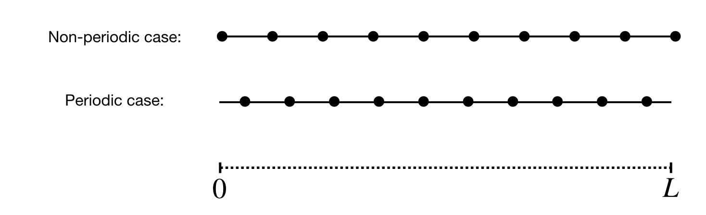

Writing your own compute.py
***************************

The functions called in the ``compute.py`` are documented in the API reference section. However, this section aims to elucidate the order and reasoning behinds the various steps when setting up a case, allocating memory and passing information from the Python layer to the Fortran layer. 

Each of the following code blocks assume that the ``dnami`` Python library has been imported as ``dn``.

Creating the tree
#################

The first ``dnami`` library function called in the `compute.py` is: 

.. code-block:: python

        dtree = dn.create_tree()

This creates a dictionary of dictionaries each containing information about different aspects of the computation henceforth referred to as the 'tree'. Many dictionaries are initially empty but some contain information derived for the pseudo-code translation and compilation steps such as a list of the solved and stored variables or the number of halo points (determined by the largest finite-difference or filter stencil). For example, inspection of the `src/dnami.py` source shows an equation-related dictionary being populated with the list of solved variables:
 
.. code-block:: python

        for v in varsolved:
                dtree['eqns']['qvec']['solved'].append([v,varname[v]])   

where ``varsolved`` was imported from information generated from the `rhs.py` file. In the case of the 1D Euler equations solved in the quickstart guide, this list would contain `rho, u, et` which are the density, the velocity and the total energy. After this tree creating step, the information about the computational parameters have to be given to the tree e.g. the grid size, the MPI domain decomposition, etc. For instance, the number of x-direction grid points ``nxgb`` can be set in the relevant section of the tree as:

.. code-block:: python

        dtree['grid']['size']['nxgb'] = nxgb

Note that this is the global number of points, not the processor specific number. The split across ``nxpr`` processors in the x-direction can be specified as:

.. code-block:: python

        dtree['mpi']['split']['nxpr'] = nxpr

Initialising the Message Passing Interface
##########################################

If the total number of processors is not one, then the next step involves setting up the Message Passing Interface via: 

.. code-block:: python

        dtree = dn.start_mpi(dtree) 

With the information supplied in the previous section, the appropriate number of MPI processes are setup with the communicators for exchanging information between neighboring subdomains and specific ones for the boundary conditions if required. Currently, dNami uses MPI4PY. For more details the reader is referred to the `MPI4PY documentation <https://mpi4py.readthedocs.io/en/stable/>`_. The user can then obtain splitting-derived information such as the local number of points in the x-direction from the updated tree: 

.. code-block:: python

        nx = dtree['mpi']['dMpi'].nx 

Note that ``dtree['mpi']['dMpi']`` is a class.

Creating the grid and writing to file
##########################################

The next step involved creating the computational grid based on the number of grid points and length in each spatial direction. The following lines create the grid and then output it to a file: 

.. code-block:: python

        dtree = dn.create_grid(dtree)
        dn.dnami_io.write_grid(dtree)

By default, the grid is written to ``out/axes.bin``. It contains the information about the grid in each spatial direction. For each given direction, a different distribution of points is adopted if said direction is periodic or not. :numref:`grid_points` illustrates the distribution of points along a domain of size :math:`L` for both cases. If the direction is non-periodic, then the first (and last) point is located on the boundary. If the direction is periodic then the grid starts :math:`\Delta l/2` into the domain and ends :math:`\Delta l/2` from the end of the domain where :math:`\Delta l /2` is the grid spacing in :math:`x`,  :math:`y` or :math:`z`. 

.. _grid_points:

     Distribution of grid points along a spatial direction with periodic and non-periodic boundary conditions
        

Allocating memory
#################

In this step, the memory used by each subprocess for the run parameters and the data (i.e. the solved and stored variables) is allocated:  

.. code-block:: python

        dtree = dn.allocate(dtree) 

Three main elements are allocated: a set of integer parameter (e.g. number of halo points, number of grid points, number of variables etc) which are used for memory reference purpose in the Fortran layer, a set of float parameters (e.g. grid spacing, time step, run constants, etc) and the data used and/or output during the run (see the difference between solved, stored and static variables). `Views <https://numpy.org/doc/stable/reference/generated/numpy.ndarray.view.html>`_ on these allocated memory regions are created so that the user can fill it (e.g. with the initial conditions) or perform operations with it (e.g. output the min/max of a given field). These views are added to the tree. The user can then create an alias to the views; for example, referring again to the 1D Euler case: 

.. code-block:: python 

        rho = dtree['eqns']['qvec']['views']['rho'] # density view
        u   = dtree['eqns']['qvec']['views']['u']   # velocity view
        et  = dtree['eqns']['qvec']['views']['et']  # total energy view

The user can then set the initial velocity field to zero:

.. code-block:: python 

       u[:] = np.float64(0.) 

To be clear, this operation does not create a new numpy array, it zeros the portion of the already-allocated memory that corresponds to the velocity variable. 

Passing information to the Fortran layer
########################################

A set of aliases for the three aforementioned arrays are created:

.. code-block:: python

        intparam,fltparam,data = (dtree['libs']['fort']['integers'],
                                  dtree['libs']['fort']['floats'],
                                  dtree['libs']['fort']['data'])

These memory references are then passed to the Fortran layer when calling the functions compiled with f2py e.g. when advancing the solution in time during the sub-RK steps:

.. code-block:: python

	dn.dnamiF.time_march(intparam,fltparam,data)  

The integer parameters (which are organised in a set pre-defined order) are used to read and modify the correct portion of the memory corresponding to ``data``. 

Computing stored variables
##########################

If the user chooses to create stored variables in the ``rhs.py`` then these quantities can be computed by invoking the appropriate function in the ``compute.py``. When specifying the stored variable in the ``rhs.py``, the user can choose whether the variable is 'static' or not. This distinction can be used to differentiate between fields that need to be calculated every time step (e.g. if the pressure is calculated and stored then used to update the RHS) or at regular intervals during the computation (e.g. an output of the vorticity field). To compute the value, the following code block is used:  

.. code-block:: python

   if 'qstored' in dtree['eqns']['qvec']['views'].keys():
        dn.dnamiF.stored(intparam,fltparam,data,m)      

where :math:`\texttt{m=0}` will compute the static variables and :math:`\texttt{m=1}` will compute the non-static variables. In the case that one of the variables is used to update the RHS, then this call should be made at every sub-RK step before the call to the ``time_march()`` funtion. 

Restarting a simulation
#######################

dNami offers a built-in function to restart a simulation from a previous output. During a simulation, if a user chooses to output 'restart' files, using the ``dnami_io.write_restart()`` function, these files can be fed back to a ``compute.py`` to fill the allocated memory and continue the simulation from that point. To do so, instead of filling the allocated memory with initial condition, the user can use the following code block:

.. code-block:: python

        dn.dnami_io.read_restart(dtree)
        ni = dtree['num']['tint']['itn']
        ti = dtree['eqns']['time']

By default, the ``dnami_io.read_restart()`` function looks for a ``restart.bin`` file in the same folder as the ``compute.py`` and reads the information it contains (a different path can be provided with additional arguments, see :doc:`/usage/api`). It also updates information in the tree such as the timestep number and time (the above code block shows this information being extracted from the tree).  

When the case is not fully periodic, the ``dnami_io.read_restart()`` will also look for a ``restartshell_i1``, ``restartshell_imax``, ``restartshell_j1``, ... depending on which direction(s) is (are) not periodic. These files contain the information outside of the core domain i.e. in the halo points and are also output by the ``dnami_io.write_restart()`` function.  

Starting your own compute
#########################

To create your own compute, we suggest that you start from an existing example that is closest to your desired case and tailor it to your needs. 

