Detailed examples 
=================

Hunga-Tonga Hunga Ha'apai volcano explosion
-------------------------------------------

On January 15th 2022, the explosion of the Hunga-Tonga Hunga Ha'apai caused unexpectedly large wave amplitudes around the world. Following the confusion surrounding warnings issued by the Japanese Meteorological Agency (JMA) witnessed by some of the authors on Okinawa, Japan, we decided to investigate the physics involved in the tsunami generation mechanisms. Rapid first attempts were made using a one-way coupled system (Euler equations for the atmosphere, shallow water equations for the water layer; the results were used to generate the animation on the index page of this website) which led us to a more thorough analysis of the theory and the simulations of the newly developed two-way coupled model illustrated hereafter. This page details the elements that go into simulating the January 15 :math:`^{th}` explosion using dNami, from setting up the symbolic equations to post-processing the output. A grid convergence study and a comparison to available measurements are also provided. All the scripts necessary to run the case are located in the ``exm/2d_tonga_TWC`` directory. 

Equations
~~~~~~~~~~~~

Resulting from the derivation in [JFM], the governing equations to be integrated using **dNami** are : 

.. math::

    \begin{equation}
    \frac{\partial}{\partial t}
    \begin{bmatrix}
        \vphantom{} \eta_1        \\
        \mathbf{V}  \\
        \rho_a        \\
        \mathbf{U}  \\
        p_a
    \end{bmatrix}
    +
    \begin{bmatrix}
         \mathbf{V}\cdot {\nabla}^{R} h_w     \\
        (\mathbf{V}\cdot {\nabla}^{R})\mathbf{V}   \\
         \mathbf{U}\cdot {\nabla}^{R} \rho_a     \\
        (\mathbf{U}\cdot {\nabla}^{R})\mathbf{U}   \\
         \mathbf{U}\cdot {\nabla}^{R} p_a
    \end{bmatrix}
    =
    -\begin{bmatrix}
        \vphantom{} h_w{\nabla}^{R}\cdot\mathbf{V}  \\
        (1/\rho_w){\nabla}^{R}(\rho_a g h_a ) + g {\nabla}^{R} \eta_1    \\
        \rho_a \Psi                                                       \\
        (1/(h_a \rho_a)){\nabla}^{R}(h_a p_a) + g {\nabla}^{R}\eta_1   \\  
        \rho_a c_a^2 \Psi 
    \end{bmatrix}.
    \end{equation}

where the :math:`\nabla^R` operator is expressed on a spherical shell at a constant radius :math:`R`, :math:`\eta_1` is the water height, :math:`h_w` is the water depth, :math:`\mathbf{V}` is the water velocity field, :math:`\rho_w` is the water density, :math:`g` is acceleration due to gravity, :math:`\rho_a` is the average atmospheric density, :math:`\Psi \equiv h_a^{-1} \nabla^R ( h_w \mathbf{V} + h_a \mathbf{U})`, :math:`h_a` is the atmospheric thickness, :math:`p_a` is the average atmospheric pressure and :math:`c_a^2 \equiv \gamma p_a/\rho_a`. For more details on the derivation of the governing equations, please see [JFM paper]. As in the paper, :math:`\theta` and :math:`\phi` are used to denote the colatitude and longitude, respectively. In practice, to avoid spurious noise generation, the governing equations are expanded such that no numerical derivative of a trigonometric function appears (all derivatives are computed analytically beforehand). These are the form of the equations that appear in the ``equations.py`` file. Furthermore, to lighten the syntax, a number of intermediate functions are included in the ``functions.py`` file to generate the pseudo-code for the spherical gradient and divergence terms that appear. The specification of the governing equations is then:

.. code-block:: python

    # -- NB: iAtmos switches atmospheric terms on/off

    # ----- Filling advection-type terms 

    # -- water
    Adv['eta1'] = 'vt *' + grads('hw',0)  + ' + vp *'  + grads('hw',1) 
    Adv['vt']   = 'vt *' + grads('vt',0)  + ' + vp *'  + grads('vt',1) 
    Adv['vp']   = 'vt *' + grads('vp',0)  + ' + vp *'  + grads('vp',1) 

    if iAtmos:
        # -- air
        Adv['rhoa']  = 'ut *' + grads('rhoa',0)  + ' + up *'  + grads('rhoa',1) 
        Adv['ut']    = 'ut *' + grads('ut'  ,0)  + ' + up *'  + grads('ut'  ,1) 
        Adv['up']    = 'ut *' + grads('up'  ,0)  + ' + up *'  + grads('up'  ,1) 
        Adv['pa']    = 'ut *' + grads('pa'  ,0)  + ' + up *'  + grads('pa'  ,1) 

    # ----- Filling source-type terms (WARNING: written on LHS!) 

    # -- water
    S['eta1']  = 'hw * ( ' + divs('vt', 'vp')  + ')' 
    S['vt']    = grads('eta1', 0)  
    S['vp']    = grads('eta1', 1)  

    if iAtmos:
        #  -- Psi
        psi = '1.0_wp/ha * (' + divs('(ha*ut + hw*vt)', '(ha*up + hw*vp)') + ')'
        ## -- Coupling terms
        S['vt']   += '+ 1.0_wp/rhow *' + grads('rhoa*ha',0)  
        S['vp']   += '+ 1.0_wp/rhow *' + grads('rhoa*ha',1)  
        ## -- air 
        S['rhoa'] = 'rhoa *' + psi 
        S['ut']   = grads('eta1a', 0) + ' + 1.0_wp/(rhoa*ha) *' + grads('pa*ha',0)  
        S['up']   = grads('eta1a', 1) + ' + 1.0_wp/(rhoa*ha) *' + grads('pa*ha',1) 
        S['pa']   = 'rhoa * ca2 * ' + psi  

In addition to the primitive variable arrays, a number of stored quantities are used in this case:

* The various trigonometric quantities that appear in the governing equations: :math:`\small{sin(\theta), cos(\theta), 1/sin(\theta)}`.  These values are filled once in the ``compute.py`` at the start of the computation. 
* The bathymetry/topography: :math:`\small{\eta_0}`. This is filled by loading values at the start of the computation. 
* The historical maximum of the water fluctuations, :math:`\small{hmax}`, and the time at which it occurs, :math:`\small{tmax}`. These are updated at a set interval during the computation. 
* The temporal forcing of the RHS related to the initial/source conditions: :math:`\small{Svar}` type terms. See sections below for details.  
* The temporal forcing of the RHS related to the non-stationary nature of the baseflow: :math:`\small{rhs\_var}` type terms. They simply contain the negative of the sum of the other quantities making up the right-hand side.  These are computed at the very start of the computation. 

Numerics
~~~~~~~~~~~~

To compute the spatial derivative, a standard 5 point, 4\ :sup:`th` order centered finite difference scheme is used. For numerical stability, an optimised 13 point, 8\ :sup:`th` order filter is used. The code block specifying these choices can be found below and in the ``genRhs.py`` file. 

.. code-block:: python 

    #GenerateRHS:
    append_Rhs(Adv, 5, 4, rhsname, vnamesrc_Adv, update=False, rhs=rhs, stored=True)
    append_Rhs(S, 5, 4, rhsname, vnamesrc_S, update=True, rhs=rhs, stored=False)
    append_Rhs(C, 5, 4, rhsname, vnamesrc_C, update=True, rhs=rhs, stored=False)
    append_Rhs(Fss, 5, 4, rhsname, vnamesrc_Fss, update=True, rhs=rhs, stored=False)

    #GenerateFilters:
    genFilter(13, 8, len(varsolved), rhs=rhs)

Note the addition of the ``C`` and ``Fss`` quantities to the RHS. These are the volcano source condition and the forcing terms related to the non-steady nature of the baseflow (see following section for details). 

Pre-processing and Computation 
~~~~~~~~~~~~~~~~~~~~~~~~~~~~~~

**Bathymetry**

Before starting the computation, global bathymetry data (obtained from `GEBCO <https://www.gebco.net/data_and_products/gridded_bathymetry_data/>`_) combined with polar ice coverage information for January 2022 (data obtained from `NSIDC <https://nsidc.org/data>`_ in polar coordinates is projected to the GEBCO data grid) is interpolated to the computational grid and written to a binary file in the dNami data format. This can then be read in parallel at run-time using the ``read_data()`` function. The ``misc.py`` file contains a utility for the steps involved in reading the bathymetry data and interpolating it. However, the thermodynamic fields constructed this way no longer respects the spherical boundary conditions and imposing them can lead to numerical instability. To remedy this, the fields are smoothed normal to each boundary (using a half sinwave) to the average value either side of the boundary  over a thin layer near the boundary (chosen to be 10 grid points).  

**Vertically-averaged atmospheric conditions**

Similarly to the bathymetry data, prior to starting the computation, the underlying fields of velocity and thermodynamic quantities are interpolated to the computational grid and written to dNami binary data format. They are derived from ERA5 data for January 15th 2022 with can be found on the `Copernicus Climate Data Store plateform <https://cds.climate.copernicus.eu/cdsapp#!/dataset/reanalysis-era5-pressure-levels?tab=overview>`_ . However, just like the thermodynamic fields, the velocity field constructed this way no longer respects the spherical boundary conditions and imposing them can lead to numerical instability. The same smoothing strategy as above is employed to remedy this.  

**Non-dimensionalisation values**

A Python class containing the values used to non-dimensionalise the input quantities is provided in ``values.py``. Their physical significance is given in the table below.

.. list-table:: Characteristic scales used to non-dimensionalise the governing equations 
    :widths: 25 25
    :header-rows: 1
    :align: center

    * - Variable name 
      - Physical meaning
    * - ``lref`` 
      - Average water depth on Earth
    * - ``uref`` 
      - Characteristic gravitational wave speed (in water) 
    * - ``tref`` 
      - Characteristic time scale based on ``lref`` and ``uref`` 
    * - ``rref`` 
      - Reference water density  
    * - ``pref`` 
      - Reference 'dynamic' pressure based on ``rref`` and ``uref`` 

**Imposing spherical boundary conditions** 

By default, a double periodic domain in dNami imposes Cartesian geometry. :numref:`spherical_procs` illustrates a configuration where the domain is shared between 8 processors (4 processors in the horizontal direction and 2 in the vertical direction). To impose spherical boundary conditions, the vertical neighbours for processors along the poles must be redefined. In addition, the horizontal swap operations are maintained whereas the vertical operations involve matching processors along the poles of the spherical domain (i.e. North or South) and flipping (both horizontally and vertically) the contents of the swapped information. These changes are illustrated for processor 3 where the bottom vertical neighbour of processor 3 is no longer 7 but 0 and the flipping of the information in the bottom halos is illustrated by the '**L**' symbol (as seen by procs 0 and 3).    

.. _spherical_procs: 
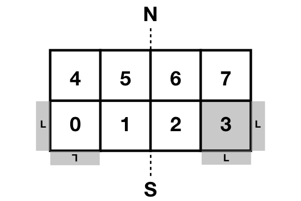

   Spherical boundary condition topology imposed via MPI where the halos of proc 3 (as seen by proc 3 and proc 0) are illustrated. N and S denote North and South respectively. 

To be able to match processors one-to-one along the poles, an even split in number of processors is imposed. The re-organisation of the processors (from the initial Cartesian geometry) is done in the following code block found in the ``compute.py`` file which sets flags in the ``dMpi`` class used in the modified ``dnami_mpi.py`` file distributed with this case:   

.. code-block:: python 

    # -- Require an even split    
    if with_proc[1] % 2 != 0:     
        if dMpi.ioproc: print('[ERROR] y-direction split must be even ...') 
        exit()      
      
    # -- Define a new position/negative direction             
    pid = dMpi.procid             
    mod = np.mod(pid, with_proc[1])             
      
    if mod <= int(with_proc[1]/2) - 1 :         
        #Copy       
        nxm = 1*dMpi.neighxm      
        nxp = 1*dMpi.neighxp      
        #Swap       
        dMpi.neighxm = nxp        
        dMpi.neighxp = nxm        
        dMpi.flipped = True       
        #Flip ud and lr           
        if dMpi.ibeg-1 == 0 or dMpi.iend == grid['nxgb']:     
            dMpi.reverse = True   
      
    # -- South pole procs         
    if dMpi.ibeg-1 == 0:          
        mid = int(with_proc[1]/2) - 1           
        if pid <= mid:            
            dp  = abs(mid-pid)    
            dMpi.neighxp = mid + dp + 1         
            dMpi.edge = True      
        else:       
            dp  = abs(mid+1-pid)  
            dMpi.neighxm = mid - dp             
            #Flip ud and lr       
            dMpi.reverse = True   
      
    # -- North pole procs         
    if dMpi.iend == grid['nxgb']: 
        mid = with_proc[0]*with_proc[1] -1 - int(with_proc[1]/2)            
        if pid <= mid:            
            dp  = abs(mid-pid)    
            dMpi.neighxm = mid + dp + 1         
        else:       
            dp  = abs(mid+1-pid)  
            dMpi.neighxp = mid - dp             
            #Flip ud and lr       
            dMpi.reverse = True   
            dMpi.edge = True      
      
    ## -- Velocity flipping - lat component must be opposite (in this case x component)   
    dMpi.sym    = dMpi.reverse and dMpi.edge    
    if iAtmos:      
        dMpi.velidx = [1,4] #vt, ut             
    else:           
        dMpi.velidx = [1] #vt     
      
**Volcano source conditions** 

Three elements are important in imposing the volcano source: 

* the relative contribution of the source to each primitive variables
* the spatial support
* the temporal support

For the first point, the amplitude of the source for each of the primitive variables is given by the components of the eigenvectors (see JFM for details). Given the nature of the atmospheric wave, a superposition of an :math:`A^+` and an :math:`A^-` mode is prescribed at the origin such that only the atmospheric pressure and density and water-level fluctuations are disturbed. The amplitudes of each of these contributions are computed in the following code block:

.. code-block:: python

    # Compute the relevant eigenmode amplitudes
    etahat = phi*H0
    rhohat = rhoa[dom]    *(lam2/C02 + Cw2/C02*(beta-1.))
    phat   = rhoa[dom]*C02*(lam2/C02 + Cw2/C02*(beta-1.))

For the second point, to avoid numerical (and physical) issues with a single point source (e.g. the addition of non-physical frequency due to the discretisation operation), the source is given a spatial support in the form of a 2D Gaussian. To ensure the Gaussian is circular (in easting/northing coordinates and not in latitude/longitude coordinates), the following code block leveraging the `haversine <https://pypi.org/project/haversine/>`_ python package is used to generate a Gaussian support based on the distance of each point to the volcano (assuming a spherical Earth).

.. code-block:: python

    def gauss(x0,y0,amp,rad0):
    	from haversine import haversine_vector, Unit
        # Generate a Gaussian support based on the distance from each point to the volcano  
    	rad0m  = rad0*Re
    	x0d    = x0*180./np.pi - 90.
    	y0d    = y0*180./np.pi - 180.
    	xld    = xloc[:,np.newaxis]*180./np.pi - 90.
    	yld    = yloc[np.newaxis,:]*180./np.pi - 180.
    	XX,YY  = np.meshgrid(xld, yld, indexing='ij')
    	darray = haversine_vector(list(zip(x0d*np.ones_like(XX).ravel(),y0d*np.ones_like(YY).ravel())),list(zip(XX.ravel(), YY.ravel())), Unit.METERS).reshape((nx,ny))
    	return amp*np.exp(- (darray**2)/(2.*rad0m**2)) 

For the last point, the explosion is modelled as a local source with a given temporal shape (amplitude and period). The :math:`Svar` terms are updated in time and used to force the RHS to give the source its temporal support. Given the shape of the observed wave and to ensure a continuous forcing (at least :math:`\mathcal{C}^1`), a 5 :math:`^{th}` order polynomial is constructed with a temporal support of duration :math:`\tau` satisfying the following constraints: the slope and value of the function at :math:`t=0` and :math:`t=\tau` must be zero and the function must reach :math:`p^+` at :math:`t=\tau/4`  and :math:`p^-` at :math:`t=3\tau/4`. Note that this term is applied as a forcing to the RHS by pre-multiplying the amplitude of the spatial Gaussian support (see following animation for illustration).  

.. code-block:: python

    def update_ft(t):

        # Default value 
        ft      = 0.

        a = (512.*pminus - 512.*pplus)/(9.*tau**5)  
        b = (-1152.*pminus + 1408.*pplus)/(9.*tau**4)            
        c =  (768.*pminus - 1280.*pplus)/(9.*tau**3)
        d = (-128.*pminus + 384.*pplus)/(9.*tau**2) 

        # - Force if time less than tau   
        if t <= tau:        
            ft= a*t**5 + b*t**4 + c*t**3 + d*t**2    

        # -- Update coefficient used to force RHS
        fltparam[5] = ft
        dtree['eqns']['coeff'][0][1] = ft

        return 

If this spatio-temporal forcing is integrated in time in 1D Cartesian coordinates with a spatial scale :math:`\sigma_x =  50` km and temporal scale :math:`\tau = 45` min, the field of density, water-level and pressure fluctuations are obtained as shown in the animation below. The parameters governing the forcing allow for the wavelength and amplitude of the crest and trough of the resulting atmospheric wave to be adjusted in accordance with the observations.  

.. only:: html

   .. _tonga_1d :
   .. figure:: vids/tonga_1d.gif 
      :width: 50%
      :align: center

      Illustration of the atmospheric wave resulting from the source forcing in 1D cartesian coordinates (uniform water depth of 2.5km and :math:`|p^+/p^-| = 2` ). 

**Extracting station information**

To compare the pressure or water-wave height at various measurement stations around the world to the result of the computation, two possibilities are available to the user: either extract the desired value at the station coordinates during the computation (co-processing) or output restart files and extract the value from the file after the computation (post-processing). The first approach can slow down the computation as it will unbalance the load between processors whereas the second can result in large storage requirements (i.e. restarts need to be stored at the correct frequency to reconstruct the desired temporal signal).  

To implement the first option, prior to starting the time advancement, the list of stations around the world is read and each processor retains the coordinates in its subdomain as shown in the following code block.

.. code-block:: python

    # -- Load station coordinates (each procs takes its own coordinates)
    coords_atm = {}

    # -- Ground pressure stations 
    for station in glob.glob('stations/**/*.bin', recursive=True):

        key = station.split('/')[-1]
        with open(station, 'rb') as fh:
            lat = np.asarray(np.load(fh, allow_pickle=True)).item()
            lon = np.asarray(np.load(fh, allow_pickle=True)).item()

        # -- Add coord to dic if point in proc 
        xp = (lat+90)/180*np.pi
        yp = (lon+180)/180*np.pi

        if (xp > xloc[0]-0.5*dx and xp<xloc[-1]+0.5*dx ) and (yp >yloc[0]-0.5*dy and yp < yloc[-1]+0.5*dy):
            coords_atm[key] = [xp, yp]

During the time loop, the value of the relevant field is interpolated by the corresponding processor using scipy's ``map_coordinates()`` function (here with alias ``MC``) and append to the relevant file to update the time history: 

.. code-block:: python 

    for key in coords_atm.keys():
        # Get coordinates from dic 
        xp, yp = coords_atm[key]
        # Global coordinate 
        nxp = xp*grid['nxgb']/Lx     
        nyp = yp*grid['nygb']/Ly     
        # Proc. local coordinate
        nxpl = nxp - (dMpi.ibeg -1)
        nypl = nyp - (dMpi.jbeg -1)
        # Interpolation
        out = MC(pa[dom], [[nxpl], [nypl]], order=1)
        # Write out
        with open(outf+'/stations/'+key[:-4]+ '_' + str(n).zfill(6) + '.bin', 'wb') as fh:
            np.save(fh,np.array([ti, out.item()]))
        fh.close()

**RHS forcing**

Due to the non-stationnary nature of the initial conditions (the underlying fields of pressure, density and velocity are not a steady-state solution to the governing equations), the RHS (without yet having introduced any perturbation related to the explosion) is computed and saved in ``rhs_var`` variables (where ``var`` is replaced by the corresponding component of the primitive variable array). As per the ``equations.py`` file, this value is subtracted from the rest of the RHS at each timestep. The code block below gives these steps and also shows that these forcing terms are written to file (in the event of a restart of the simulation). 

.. code-block:: python 

    # -- Get RHS forcing terms 
    if iGetRhs and not iRestart:
        # - Swap q fields
        dMpi.swap(q,hlo,dtree)

        # - Compute forcing terms -- ONLY DO THIS ONCE
        if 'qstored' in dtree['eqns']['qvec']['views'].keys():
            dn.dnamiF.stored(intparam, fltparam, data)
            dMpi.swap(qstored,hlo,dtree,spherical=False)

        # - Write them out if used for restarting
        rhsnames = []
        for key in fsskeys:
            rhsnames.append( 'rhs_' + key  )
        if dMpi.ioproc:
            print(' > Saving ...', rhsnames)
        dn.dnami_io.write_data(rhsnames,0,0,dtree,fpath=outf+'force/',fname='rhs')

        # ...

**I/O and time-loop updates**

During the time loop, at intervals governed by the value of ``tdup``, after the solution has been updated by the RK steps, the historical water-level fluctuation and the occurance time are updated by: 

.. code-block:: python 

    # -- Update historical hmax and tmax
    if tdmax > tdup :
        idx = np.nonzero(np.abs(eta1[dom]) > (hmax[dom]+1e-8) ) # add epsilon to remove noise (e.g. filtering) from time history
        hmax[dom][idx] = np.abs(eta1[dom][idx])
        tmax[dom][idx] = ti
        tdmax = 0.

Following this, at intervals governed by the value of ``tdcstep``, a restart file is written and the updated values of ``hmax`` and ``tmax`` are output.   

.. code-block:: python

   if tdc > tdcstep : 
       # -- Write restart
       dn.dnami_io.write_restart(n,ti,0,dtree,fpath=resf)
       # -- Write hmax/tmax 
       dn.dnami_io.write_data(['hmax', 'tmax'],n,ti,dtree,fpath=outf+'historical/',fname='hmax_tmax')
       # -- Reset time
       tdc = 0.

Output and post-processing
~~~~~~~~~~~~~~~~~~~~~~~~~~

The ``plot_water_air.py`` script provides a basic utility to plot the simultaneous water and ground pressure level fluctuations. The script reads in the list of restart files and it will output images to generate animations such as the one below.  

.. only:: html

   .. _tonga_viz:
   .. figure:: vids/tonga.gif 
      :width: 90%
      :align: center

      Animation of the atmospheric and water-height disturbance due to the Tonga volcano explosion computed with dNami using the two-way coupled model. Water-height fluctuations are shown in cyan/yellow and ground pressure fluctuations in black/white.

Convergence and comparison to measurements
~~~~~~~~~~~~~~~~~~~~~~~~~~~~~~~~~~~~~~~~~~

To demonstrate the convergence of the results with grid refinement and to illustrate how the model compares to measurements on the day, a few comparison are provided below. On the issue of grid convergence, the spatial scale of the volcano source is scale to ensure it is always 'sufficiently resolved' at lower grid sizes to avoid the discretisation of a point-source or under-resolved perturbation. Here, 'sufficiently resolved' is defined as :math:`\sigma_x/\Delta \geq 5` where :math:`\Delta` is the spatial resolution at the source. Therefore, the spatial scale is to be :math:`\sigma_x = max(\sigma_x^t, 5\Delta)` where :math:`\sigma_x^t = 50` km is the target spatial scale. This corresponds to one-scale separation away from the shock propagation scale (which is also in agreement with the vertical span of the perturbation).  As such, the final values of water-level and atmospheric pressure are only expected to converge after the target spatial scale is 'sufficiently resolved'. The crossing of this threshold as a function of grid size is illustrated in :numref:`tonga_res` as well as the grid sizes presented below. 

.. _tonga_res: 
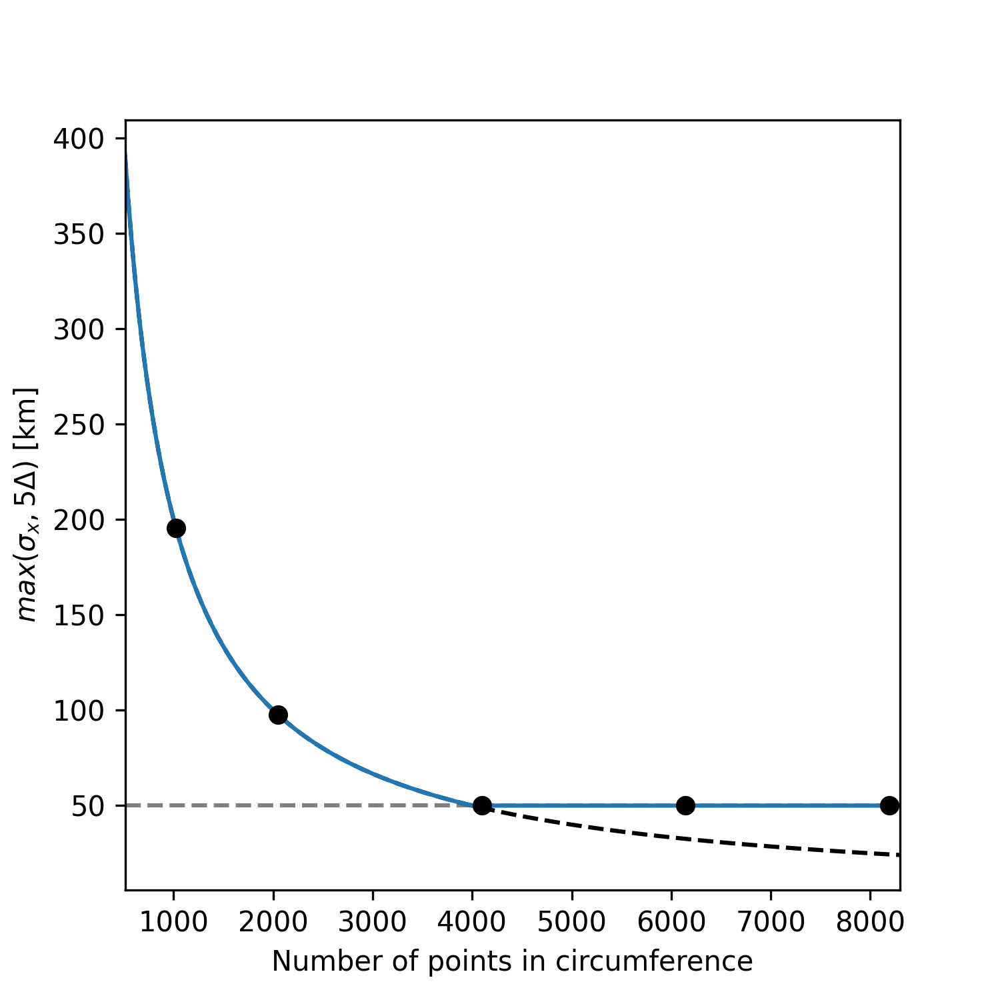

   Resolution of the spatial support for the volcano source condition and grid sizes used below (black dots) 

Historical maximum 
^^^^^^^^^^^^^^^^^^^^^

The historical maximum of the absolute sea surface fluctuations are given at various grid sizes as an illustration of convergence of the results with mesh refinement. Note however that the highest resolution available for the bathymetry grid is 86400x43200 thefore smaller scale features will continue to appear in the final solution until that grid resolution is reached. 

.. _hmax_1: 
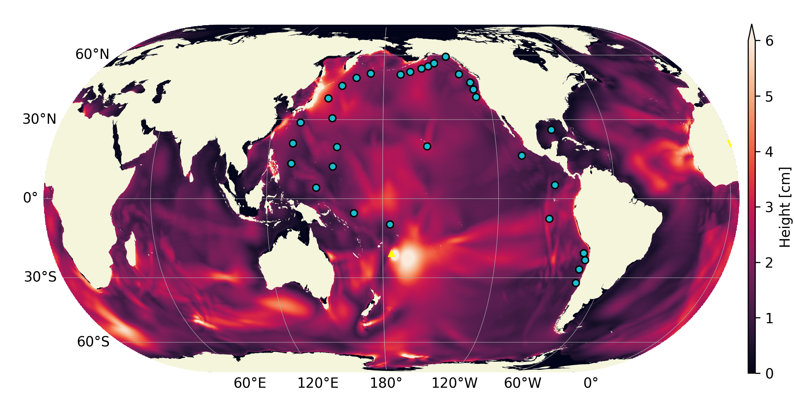

.. _hmax_2: 

.. _hmax_3: 
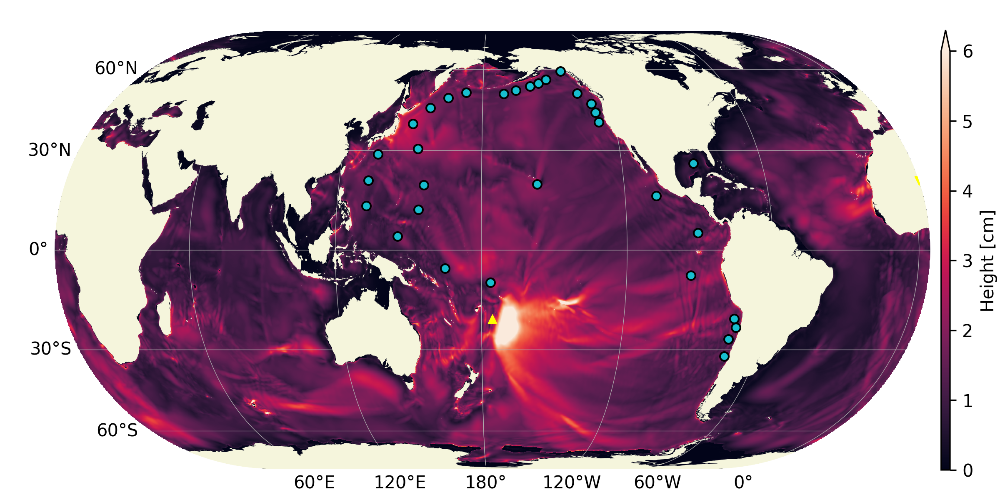

.. _hmax_4: 
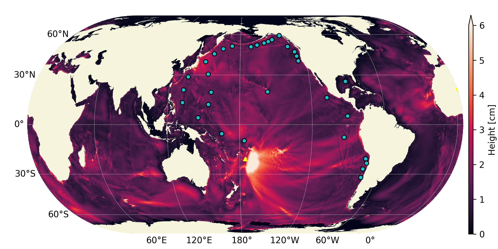

   Historical maximum of water-level fluctuation 18 hours after the explosion for grid sizes 1024x512, 2048x1024, 4096x2048, 6144x3072 . For the first [2] frames, the perturbation wavelength is greater than the target wavelength as illustrated in :numref:`tonga_res`. Note how for frames [3-4] the atmospheric wave is converged but smaller structures appear in the historical maximum wave height as the bathymetry is more resolved.  

Pressure measurements
^^^^^^^^^^^^^^^^^^^^^

Four sources are used to gather pressure measurements from around the world: Weather News Inc. from Japan (kindly provided a dataset upon request, `see here <https://global.weathernews.com/news/16551/>`_), Iowa State University hosts 1 minute data from ASOS sites in the USA (`IASTATE <https://mesonet.agron.iastate.edu/request/asos/1min.phtml>`_), Sensor Community archive data (`SensCom <https://archive.sensor.community/>`_) and a signal from the University of Reading (`UoR <https://researchdata.reading.ac.uk/354/>`_). The location of each of these sensors is given in :numref:`psensor_loc`

.. _psensor_loc: 
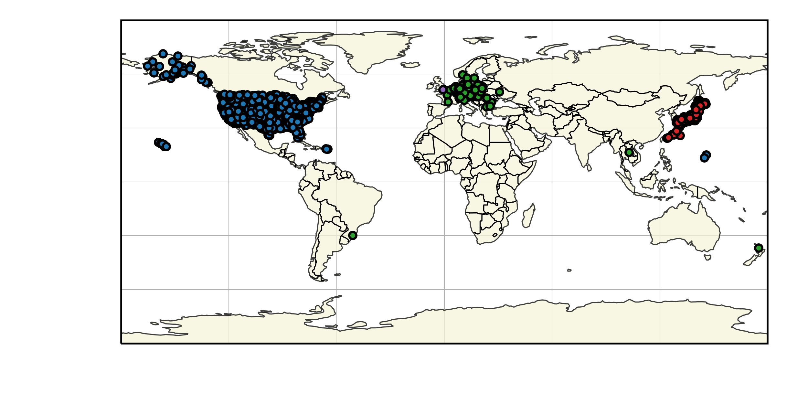

   Worldwide distribution of the pressure sensors used for comparison (blue: ASOS data, green: Sensor Archive data, Red: Weather News Inc. data, purple: University of Reading data).  

Values of ground level atmospheric pressure fluctuation at the corresponding locations are obtained from dNami by bilinear interpolation of the pressure on the computational grid (either at run-time or after-the-fact). The result is shown in  (where a tag of the same colour as in :numref:`psensor_loc` has been added to identify to which group the measured signal belongs). 

.. _groundp_1: 
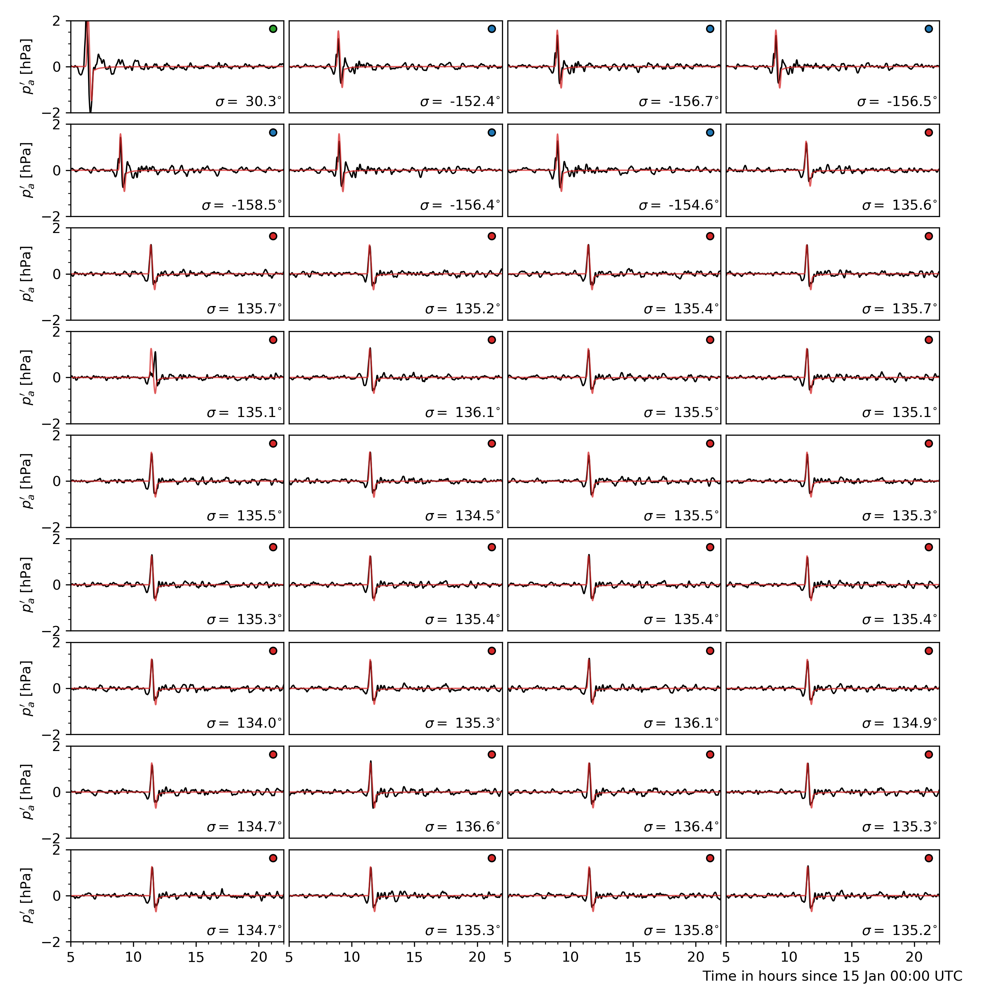

.. _groundp_2: 
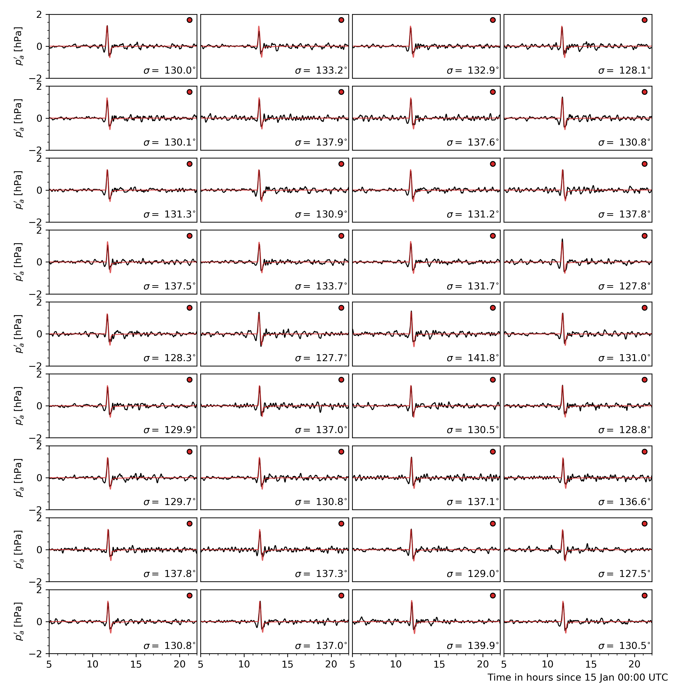

.. _groundp_3: 
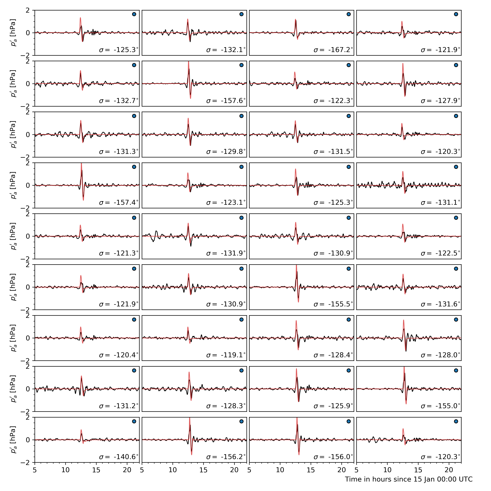

.. _groundp_4: 
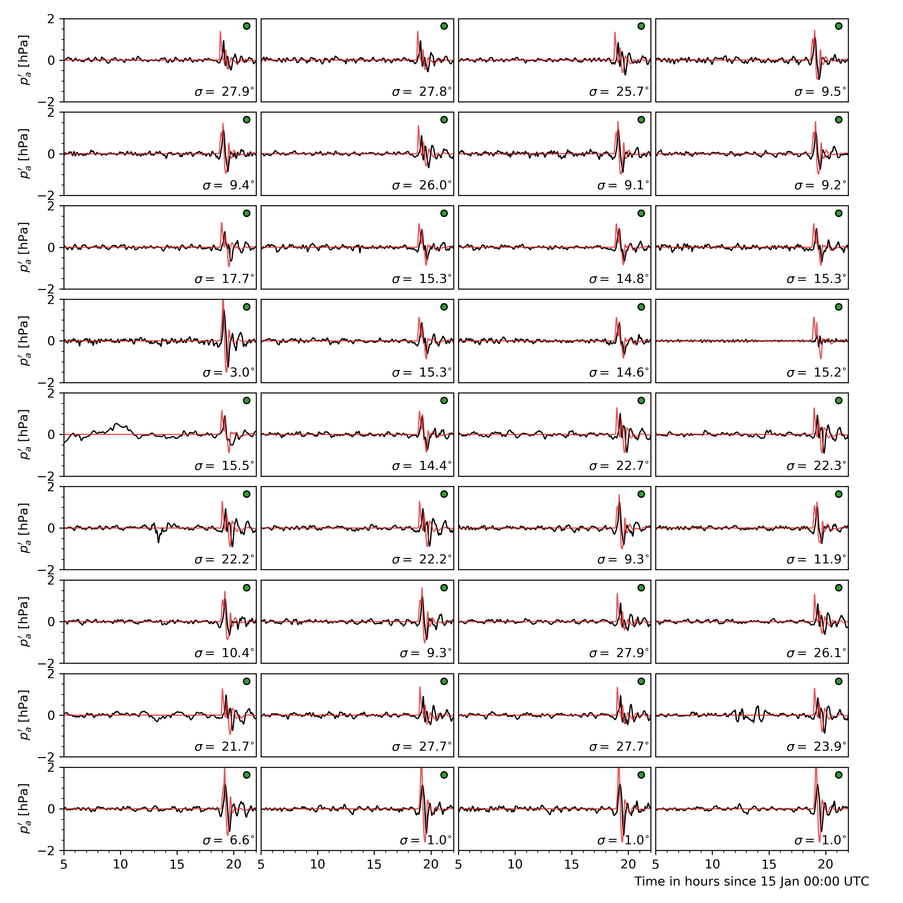

   Comparison of ground pressure sensor data (black) to dNami signal (red). A low-pass filter with a cutoff period of 10 minutes was applied to the sensor data. The panel are sorted by their distance from the volcano. Each panel has a tag associating it to a sensor group with the same colour code as in :numref:`psensor_loc`. The bearing from the sensor to the volcano is given in the bottom right of each panel.  

To demonstrate convergence of the pressure signal with grid refinement (and corresponding convergence of the signal's spatial support), results from computations on increasingly refined grids are presented in :numref:`compare_groundp`. 

.. _compare_groundp: 
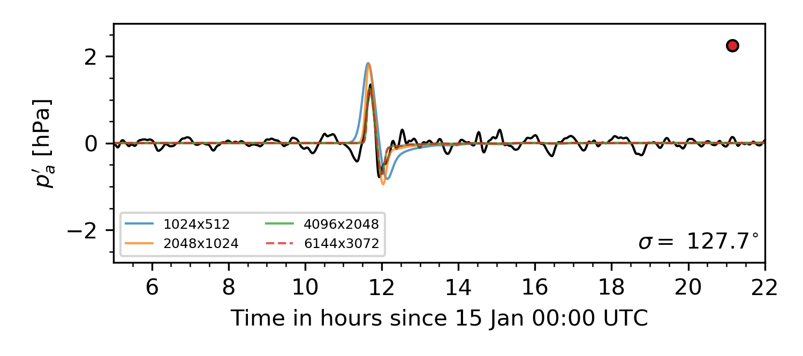

   Example of grid convergence of the ground pressure signal compared to a sensor in Japan. 

DART tide data
^^^^^^^^^^^^^^^^^^^^^

Data from Deep-ocean Assessment and Report of Tsunamis (DART) probes was gathered from the `NOAA <https://www.ngdc.noaa.gov/hazard/dart/2022tonga.html>`_. The location of the probes is shown in :numref:`dart_loc`. In deep water, where the hypotheses involved in deriving the shallow water equations are satisfied, a quantitative comparison can be made between measurements and results from the theory. It should be noted however that the water height fluctuation given by the DART probes does not take into account atmospheric pressure fluctuations.   

.. _dart_loc: 
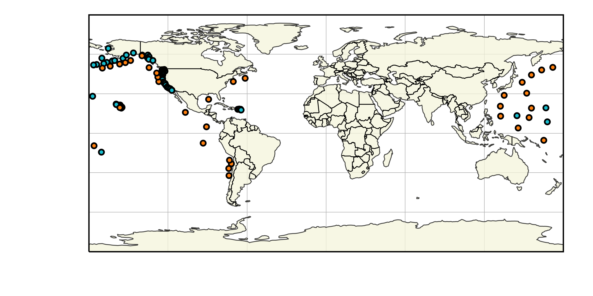

   Distribution of the DART sensors (orange) used for comparison and other NOAA tide sensors (cyan).

Similarly to what is done for the pressure sensors, signals from the computation are extracted at each DART probe location and compared to the real-world measurements in :numref:`dart_comp`. For comparison, the DART data is filtered with a bandpass filter with cutoff periods of 4 minutes and 4 hours (to remove wave noise and tide related content). In addition, for a compatible comparison with what is provided by DART, the ocean bottom pressure fluctuations are compared (rather than the water-height fluctuations). NOAA-sourced DART data is converted back to bottom pressure fluctuations using the constant 670mm/psia given by `DART documentation <https://www.ndbc.noaa.gov/dart/dart.shtml>`_. 

.. _dart_comp: 
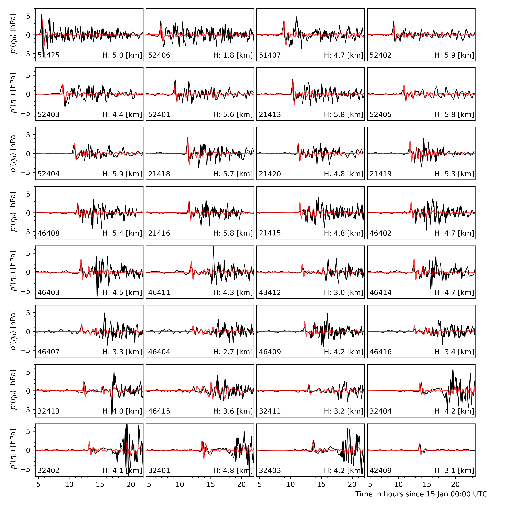

   Comparison of DART data (black) to TWC dNami simulation signal (red). The DART code and sensor depth are given for each location. The panels are sorted by distance from the volcano. 

To demonstrate convergence of the water-level fluctuation with grid refinement, results from computations on increasingly refined grids are presented in :numref:`compare_dart`. Note that smaller wavelength contributions will continue to appear with grid refinement until the maximum resolution of the bathymetry is reached (roughly 400m/direction). 

.. _compare_dart: 
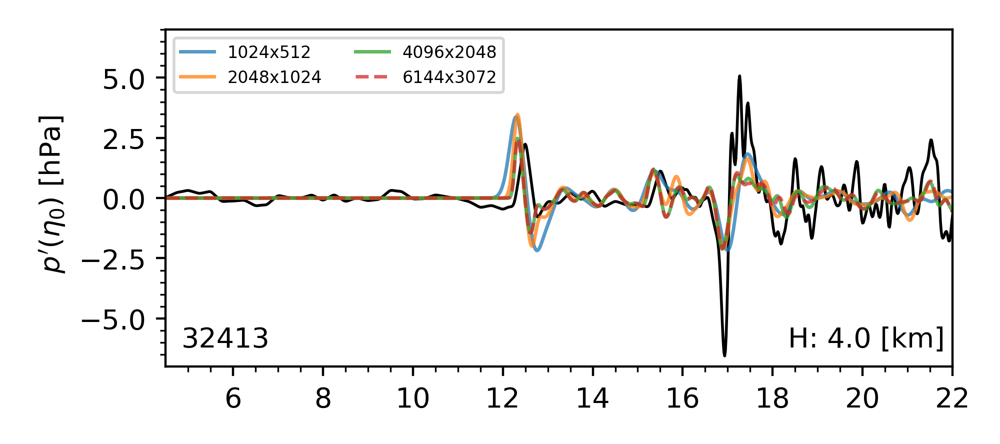

   Example of grid convergence of the ocean bottom pressure signal compared to DART data from a sensor off the coast of Peru.  

Water-layer only
^^^^^^^^^^^^^^^^

To illustrate the impact of the coupling and contribution of the atmospheric wave, a case without the atmospheric layer is run. Only the water layer is advanced in time with a source condition which uses only the :math:`\eta_1` contribution detailed above. The resulting historical maximum water-height fluctuation is given in :numref:`hmax_water` over the same 18 hour period. Note how, given the slower speed of gravity wave propagation in the water and the necessity to circumvent land, the perturbation does not travel as far, barely making it past South America and does not reach Africa. Furthermore, the energy injected into the water layer, without the atmospheric coupling, is not enough to explain the observed global tsunamis in the wake of the volcano eruption.  

.. _hmax_water: 
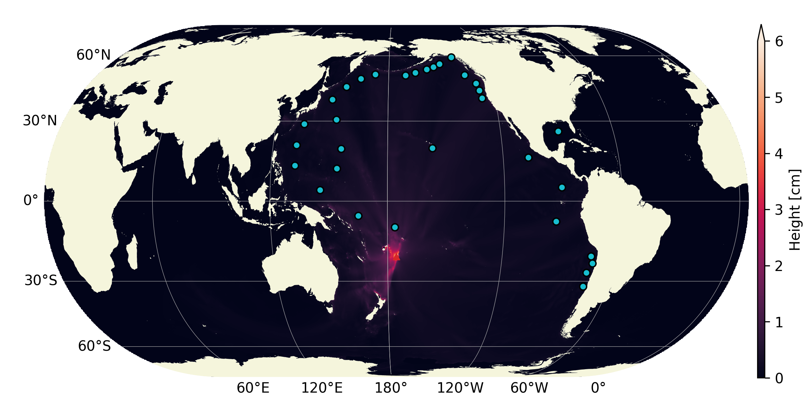

   Historical maximum of the water-height fluctuation when only simulating the water-layer (i.e. no atmospheric wave injecting energy intothe water layer) - grid: 4096x2048 
