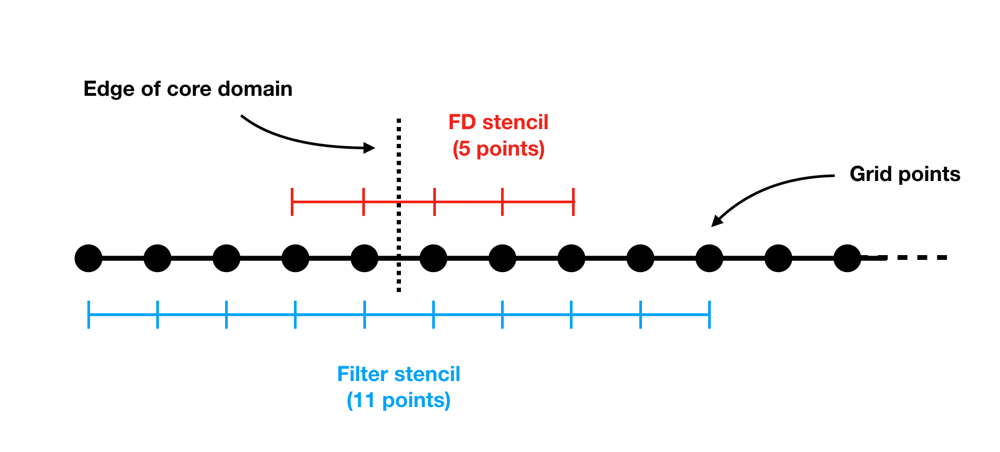
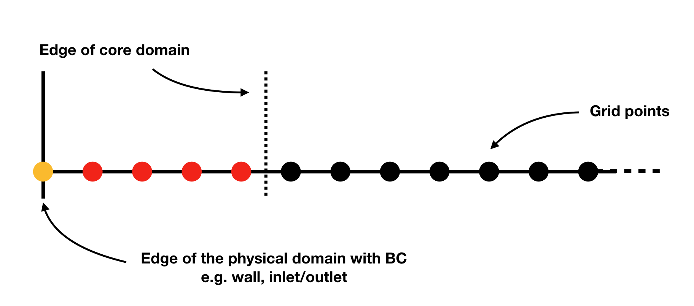

Writing your own genRhs.py
***************************

The functions called in the ``genRhs.py`` are documented in the API reference section. However, this section aims to elucidate the order and reasoning behinds the various steps when setting up the Partial Differential Equations (PDEs) system to be solved together with Boundary Conditions (BCs) and specifying numerical parameters associated to the automatic discretisation of derivative operators. A section aiming at describing how loop-distribution and -fusion can conveniently be done without digging into the Fortran layer is also provided.

How to generate the discretised equations
########################################################

``genRhs.py`` is the user-level module that specifies the system of equations to be marched in time. For convenience, this process is often divided into two steps: 1) the PDEs and BCs specifications through a series of dictionaries and lists, and 2) the Fortran source code generation through appropriate calls to ``genKer.py`` user-level functions.

Assume that ones want to march in time the 2D compressible Euler equations given by:

.. math::

   \dfrac{\partial }{\partial t} \begin{pmatrix} \rho  \\ \rho u \\ \rho v  \\ \rho e_t \end{pmatrix}  + \dfrac{\partial }{\partial x} \begin{pmatrix} \rho u   \\ \rho u^2 + p \\ \rho u v    \\ u ( \rho e_t + p) \end{pmatrix}  + \dfrac{\partial }{\partial y} \begin{pmatrix} \rho v   \\ \rho u v \\ \rho v^2 + p    \\ v ( \rho e_t + p) \end{pmatrix} = \mathbf{0}

**Setting equations in rhs.py**
 
PDEs and BCs specifications are typically done in a separate file, hereafter named ``rhs.py``. This file should contain the set of PDEs provided through dictionaries (see below) and a series of specific lists needed by dNami. The first parameter to be put in ``rhs.py`` is the number of spatial dimensions:

.. code-block:: python

			dim = 2 # can be 1,2 or 3

*Dictionaries of equations*

dNami does not contain any preset symbols or limited forms of PDEs. It is the user responsibility to declare the list of symbols needed to write the PDEs that will be marched in time and the corresponding equations. This is done through the ``varname`` dictionary (needed by the framework):

.. code-block:: python

	varname  = {'rho' : 1,
		    'u'   : 2,
		    'v'   : 3,
		    'et'  : 4, 
		    }

The order set with the indexes in ``varname`` corresponds to data location in memory. Variables solved in the left-hand side are specified in ``varsolved``.

.. code-block:: python

	varsolved = ['rho','u','v','et']

Setting RHS equations is done through a dictionary of the form 

.. code-block:: python

	{'Variable Name': 'Pseudo-Code Eqns'}

The ``Variable Name`` must match one of the ``varname`` keys. ``Pseudo-Code Eqns`` refers to symbolic expressions using ``varname`` keys or Fortran compatible syntax (Fortran internal functions are allowed here). 

.. warning::

	Although dNami marches in time systems of the form:

	.. math::

   		\dfrac{\partial \textbf{q} }{\partial t} = f\left( \textbf{q} \right)

    The ``'Pseudo-Code Eqns'`` fed to the code generation step and referred throughout this documentation as 'RHS' must be equal to :math:`-f(\textbf{q})` i.e.: 

    .. code-block:: python

        {'Variable Name': 'Pseudo-Code Eqns for -f(q)'}

For the x derivative of the RHS in the 2D Euler equations we would write:

.. code-block:: python
	
	divFx = {'rho' : ' [ rho*u           ]_1x ', 
    		 'u'   : ' [ rho*u*u + p     ]_1x ', 
    		 'v'   : ' [ rho*v*u         ]_1x ', 
    		 'et'  : ' [ (rho*et + p )*u ]_1x ', 
                }

In this expression the pressure is introduced through a new symbol, ``'p'``, not defined in ``varname``. Two possibilities are offered by dNami in such cases. The first one is to provide an equation that relates ``'p'`` with ``varname`` variables, this is done through the ``varloc`` dictionary:

.. code-block:: python

        varloc = { 'e' : ' (et - 0.5_wp*u*u) ',                        
                   'p' : '       rho*e       ',                        
                 }

dNami will automatically replace any occurrence of ``'p'`` with the corresponding combination of ``varname`` variables in all treatment of ``'Pseudo-Code Eqns'`` provided to the kernel (through ``append_Rhs`` or ``genBC``).
Another option is to allocate static memory for ``'p'`` and compute ``'p'`` before filling the RHS, where only memory access to that location are done. This is done through the ``varstored`` dictionary:

.. code-block:: python
	
	varloc    = {'e' : ' (et - 0.5_wp*u*u) '}                      
	varstored = {'p' : {'symb': 'rho*e', 'ind': 1, 'static': True}

In this example, an equation is provided to compute ``'e'`` from ``varname`` and ``'p'`` is stored at the first location of the stored-data memory. For what follows, we will assume that the ``x`` and ``y`` derivative of the flux function have been grouped in one dictionary ``divF`` as :

.. code-block:: python
	
	divF = {'rho' : ' [ rho*u           ]_1x  + [ rho*v           ]_1y ', 
    		'u'   : ' [ rho*u*u + p     ]_1x  + [ rho*u*v         ]_1y ', 
    		'v'   : ' [ rho*v*u         ]_1x  + [ rho*v*v         ]_1y ', 
    		'et'  : ' [ (rho*et + p )*u ]_1x  + [ (rho*et + p )*v ]_1y ', 
                }

**Filling out the genRhs.py: Compulsory steps**

The first lines in any ``genRhs.py`` will involve importing the necessary code-construction functions from the ``genKer.py``. Then, the working precision of the computation is specified via the ``wp`` variable.  

.. code-block:: python

        from genKer import rhsinfo, genrk3, genrk3update, genFilter, genBC, append_Rhs, genbcsrc
        import os 
        
        wp = 'float64'

dNami offers the flexibility of using a combination of different numerical schemes as well as a filter with each relying on a stencil size that need not be identical. :numref:`hlo_glob`. illustrates the stencils for a filter that uses 11 points and a finite-difference scheme that uses 5 points. 

.. _hlo_glob: 

   Two different stencil sizes 

To construct the loops over the domain, the ``genRhs.py`` requires the user to specify the overall largest number of halo points required to satisfy all the stencil sizes used in the run. In the example of :numref:`hlo_glob`, this would be 5. The ``hlo_glob`` variable is used to give this information to the code-generation process:

.. code-block:: python

        hlo_glob = 5

Next, the user must initialise the ``rhs`` class which is used to store and transfer information from one step to the next: 

.. code-block:: python

    from genKer import rhs_info    
    rhs = rhs_info()

Then, the Runge--Kutta time-marching steps are generated with calls to the following functions:

.. code-block:: python

    genrk3(      len(varsolved),rhs=rhs) 
    genrk3update(len(varsolved),rhs=rhs)

Finally, at least one equation must be specified to set the RHS used to march the variables in time, for example:

.. code-block:: python

	append_Rhs(divF,5,4,rhsname,vnamesrc_divF,update=False,rhs=rhs,stored=False)

which generates the discretised version of ``divF`` using a 5 point, 4\ :sup:`th` order centered finite difference scheme with ``rhsname`` being used to generate code comments and ``vnamesrc_divF`` being used to generate intermediate variable names. The ``update=False`` argument guarantees that the components of ``divF`` are being used to set the RHS rather than be added to existing terms. The ``stored=False`` argument determines if the stored variables (see the related Advanced use section below) are computed with the stencil/order given as input to the ``append_Rhs()`` function; note that only one call with ``stored=True`` is possible, i.e. all stored quantities will be discretised with the same scheme. 

This ends the list of compulsory steps when creating a ``genRhs.py``. 

.. warning::

    When no boundary conditions are specified in a given direction, the default behaviour assumes that the direction is **periodic**. 
        

**Filling out the genRhs.py: Optional steps**

The user has access to a number of additional automatic code-generation steps detailed here.  

*Adding explicit filtering*

To add explicit filtering to the computation, the user can call the ``genFilter`` function. Currently, the function relies on pre-specified coefficients for a given stencil/order (which can be found at the start of the ``genKer.py`` file). For example, the following code block generates code to apply a standard 11 point, 10\ :sup:`th` order filter to each of the directions (between 1 and 3 depending on ``dim``): 

.. code-block:: python

    # Generate Filters (if required):      
    genFilter(11,10,len(varsolved),rhs=rhs)

The user can specify the filter amplitude in the ``compute.py``. 

*Adding boundary conditions*

When non-periodic boundary conditions are enforced, the user must do two things: choose what happens between the core and the boundaries (i.e. those who do not have enough neighbours for the full stencil width) and specify the boundary conditions. These two sets of points are illustrated in :numref:`non_core_and_edge`. 

.. _non_core_and_edge: 

   The two sets of points that must be managed seperately from the core of the domain: the physical boundary points (orange) and the points that do not have enough neighbours for the full stencil width (red)

Both of these cases are dealt with via calls to the ``genBC()`` function.  

.. warning:: 

   Before making a call to the append_Rhs() function, make a copy of the equation dictionnaries to avoid unwanted intermediate modification

The following code block details the two steps: after making a copy of the equations and calling the ``append_Rhs()`` function, a first call to ``genBC()`` is made. This performs an automatic stencil and order reduction of the finite-difference schemes and the filter (based on the set of coefficients currently included in dNami) as the boundary is approached. However this does nothing for the actual boundary point (shown in orange in :numref:`non_core_and_edge`). That point is handled by additional calls to ``genBC()`` for each boundary condition (points in 1D, corner and lines in 2D, corners, lines and faces in 3D). For each, the user can specify whether the boundary condition acts on a primitive variable or on the RHS via the ``setbc`` argument. In the dictionary in the list supplied to this argument, the ``'char'`` is a name variable used for code comments, ``'i1'`` refers to the location of the boundary (here face 'i1' which in 1D is a point) and ``rhs`` which means that the equations supplied in ``src_phybc_wave_i1`` are to act on the RHS.  

.. code-block:: python

        Save_eqns = {'divF':divF.copy()}

        #... <- append_Rhs() calls made here 

        # Progressive stencil/order adjustement from domain to boundary 
        genBC(Save_eqns['divF'],3,2,rhsname,vnamesrc_divF,update=False,rhs=rhs)

        # Boundary conditions on d(q)/dt
        #i1
        genBC(src_phybc_wave_i1  ,3,2,rhsname,vnamesrc_divFbc,setbc=[True,{'char':{'i1'. :['rhs']}}],update=False,rhs=rhs)
        #imax
        genBC(src_phybc_wave_imax,3,2,rhsname,vnamesrc_divFbc,setbc=[True,{'char':{'imax':['rhs']}}],update=False,rhs=rhs)

In 3D, if non-periodic condition are desired then a boundary condition for each physical boundary must be supplied i.e. face ``i1``, line ``i1j1``, corner ``i1j1k1``, face ``imax``, line ``imaxj1`` and so on ...  

Advanced use: control of the Fortran loop distribution
######################################################

For optimisation purposes, the user can choose to split the 'do-loops' generated from the pseudo-code in a number of different ways. Here we present a simple way to split the 'do-loops' over the components of the RHS (other alternatives include splitting by derivative direction, splitting by groups of terms, etc) which can lead to more efficient memory access for certain configurations. 

Let us assume that the user has created the following ``rhs.py`` for their one-dimensional case:

.. code-block:: python

        # - Local variables
        varloc = { 'e'  : ' (et - 0.5_wp*u*u) ',  # internal energy
                   'p'  : 'delta*rho*e        ',  # pressure equation of state
                 }

        # - Divergence of the flux function 
        divF   = {  
                  'rho' : ' [ rho*u          ]_1x ', 
                  'u'   : ' [ rho*u*u + p    ]_1x ', 
                  'et'  : ' [ u*(rho*et + p) ]_1x ', 
                 }

In addition, the dictionaries containing the term nomenclature for the Fortran code are:

.. code-block:: python

        # .. for comments in the Fortran file
        rhsname       = {'rho'  : 'd(rho)/dt',
                         'u'    : 'd(rho u)/dt',
                         'et'   : 'd(rho et)/dt',
                        }

        # .. name tags to use for intermediate variables created by the constructor
        vnamesrc_divF = {'rho'  : 'FluRx',
                         'u'    : 'FluMx',
                         'et'   : 'FluEx',
			}

which are used to set variable names and generate comments in the Fortran code blocks below. Simply passing the ``divF`` dictionary to the ``append_Rhs`` function: 

.. code-block:: python

	append_Rhs(divF,3,2,rhsname,vnamesrc_divF,update=False,rhs=rhs)

will produce the following Fortran code:

.. code-block:: fortran

        !***********************************************************
        !                                                           
        ! Start building RHS with source terms (1D) ****************
        !                                                           
        !***********************************************************

         
              do i=idloop(1),idloop(2) 

        !***********************************************************
        !                                                           
        ! building source terms in RHS for d(rho)/dt ***************
        !                                                           
        !***********************************************************

        !~~~~~~~~~~~~~~~~~~~~~~~~~~~~~~~~~~~~~~~~~~~~~~~~~~~~~~~~~~~
        !
        ! [rho*u]_1x
        !
        !~~~~~~~~~~~~~~~~~~~~~~~~~~~~~~~~~~~~~~~~~~~~~~~~~~~~~~~~~~~

        d1_FluRx_dx_0_im1jk = q(i-1,indvars(1))*q(i-1,indvars(2))

        d1_FluRx_dx_0_ip1jk = q(i+1,indvars(1))*q(i+1,indvars(2))

        d1_FluRx_dx_0_ijk = -&
                  0.5_wp*d1_FluRx_dx_0_im1jk+&
                  0.5_wp*d1_FluRx_dx_0_ip1jk

        d1_FluRx_dx_0_ijk = d1_FluRx_dx_0_ijk*param_float(1)

        !***********************************************************
        !                                                           
        ! Update RHS terms for d(rho)/dt ***************************
        !                                                           
        !***********************************************************

        rhs(i,indvars(1)) =   -  ( d1_FluRx_dx_0_ijk ) 

        !***********************************************************
        !                                                           
        ! building source terms in RHS for d(rho u)/dt *************
        !                                                           
        !***********************************************************

        !~~~~~~~~~~~~~~~~~~~~~~~~~~~~~~~~~~~~~~~~~~~~~~~~~~~~~~~~~~~
        !
        ! [rho*u*u+p]_1x
        !
        !~~~~~~~~~~~~~~~~~~~~~~~~~~~~~~~~~~~~~~~~~~~~~~~~~~~~~~~~~~~

        d1_FluMx_dx_0_im1jk = q(i-1,indvars(1))*q(i-1,indvars(2))*q(i-1,indvars(2))+param_float(1 + 5)*q(i-1,indvars(1))*((q(i-1,indvars(3))-&
                            0.5_wp*q(i-1,indvars(2))*q(i-1,indvars(2))))

        d1_FluMx_dx_0_ip1jk = q(i+1,indvars(1))*q(i+1,indvars(2))*q(i+1,indvars(2))+param_float(1 + 5)*q(i+1,indvars(1))*((q(i+1,indvars(3))-&
                            0.5_wp*q(i+1,indvars(2))*q(i+1,indvars(2))))

        d1_FluMx_dx_0_ijk = -&
                  0.5_wp*d1_FluMx_dx_0_im1jk+&
                  0.5_wp*d1_FluMx_dx_0_ip1jk

        d1_FluMx_dx_0_ijk = d1_FluMx_dx_0_ijk*param_float(1)

        !***********************************************************
        !                                                           
        ! Update RHS terms for d(rho u)/dt *************************
        !                                                           
        !***********************************************************

        rhs(i,indvars(2)) =   -  ( d1_FluMx_dx_0_ijk ) 

        !***********************************************************
        !                                                           
        ! building source terms in RHS for d(rho et)/dt ************
        !                                                           
        !***********************************************************

        !~~~~~~~~~~~~~~~~~~~~~~~~~~~~~~~~~~~~~~~~~~~~~~~~~~~~~~~~~~~
        !
        ! [u*(rho*et+p)]_1x
        !
        !~~~~~~~~~~~~~~~~~~~~~~~~~~~~~~~~~~~~~~~~~~~~~~~~~~~~~~~~~~~

        d1_FluEx_dx_0_im1jk = q(i-1,indvars(2))*(q(i-1,indvars(1))*q(i-1,indvars(3))+&
                            param_float(1 + 5)*q(i-1,indvars(1))*((q(i-1,indvars(3))-&
                            0.5_wp*q(i-1,indvars(2))*q(i-1,indvars(2)))))

        d1_FluEx_dx_0_ip1jk = q(i+1,indvars(2))*(q(i+1,indvars(1))*q(i+1,indvars(3))+&
                            param_float(1 + 5)*q(i+1,indvars(1))*((q(i+1,indvars(3))-&
                            0.5_wp*q(i+1,indvars(2))*q(i+1,indvars(2)))))

        d1_FluEx_dx_0_ijk = -&
                  0.5_wp*d1_FluEx_dx_0_im1jk+&
                  0.5_wp*d1_FluEx_dx_0_ip1jk

        d1_FluEx_dx_0_ijk = d1_FluEx_dx_0_ijk*param_float(1)

        !***********************************************************
        !                                                           
        ! Update RHS terms for d(rho et)/dt ************************
        !                                                           
        !***********************************************************

        rhs(i,indvars(3)) =   -  ( d1_FluEx_dx_0_ijk ) 

           enddo

This is a single 'do-loop' over the points in the x-direction which updates all three components of the RHS. However, a simple modification of the call the ``append_Rhs()`` function allows the user to split the Fortran code into three seperate x-direction loops. Three calls are made to the ``append_Rhs()`` function with a dictionnary of a single components of the RHS being passed as the input each time: 

.. code-block:: python

    append_Rhs({'rho': divF['rho']}, 3, 2, {'rho': rhsname['rho']}, {'rho':vnamesrc_divF['rho']}, update=False,rhs=rhs,stored=True )
    append_Rhs({'u'  : divF['u']  }, 3, 2, {'u'  : rhsname['u']  }, {'u'  :vnamesrc_divF['u']  }, update=False,rhs=rhs,stored=False)                           
    append_Rhs({'et' : divF['et'] }, 3, 2, {'et' : rhsname['et'] }, {'et' :vnamesrc_divF['et'] }, update=False,rhs=rhs,stored=False)                           

This will procude the following three 'do-loops' in the Fortran code:

.. code-block:: fortran

        !***********************************************************
        !                                                           
        ! Start building RHS with source terms (1D) ****************
        !                                                           
        !***********************************************************

         
              do i=idloop(1),idloop(2) 

        !***********************************************************
        !                                                           
        ! building source terms in RHS for d(rho)/dt ***************
        !                                                           
        !***********************************************************

        !~~~~~~~~~~~~~~~~~~~~~~~~~~~~~~~~~~~~~~~~~~~~~~~~~~~~~~~~~~~
        !
        ! [rho*u]_1x
        !
        !~~~~~~~~~~~~~~~~~~~~~~~~~~~~~~~~~~~~~~~~~~~~~~~~~~~~~~~~~~~

        d1_FluRx_dx_0_im1jk = q(i-1,indvars(1))*q(i-1,indvars(2))

        d1_FluRx_dx_0_ip1jk = q(i+1,indvars(1))*q(i+1,indvars(2))

        d1_FluRx_dx_0_ijk = -&
                  0.5_wp*d1_FluRx_dx_0_im1jk+&
                  0.5_wp*d1_FluRx_dx_0_ip1jk

        d1_FluRx_dx_0_ijk = d1_FluRx_dx_0_ijk*param_float(1)

        !***********************************************************
        !                                                           
        ! Update RHS terms for d(rho)/dt ***************************
        !                                                           
        !***********************************************************

        rhs(i,indvars(1)) =   -  ( d1_FluRx_dx_0_ijk ) 

           enddo

        !***********************************************************
        !                                                           
        ! Start building RHS with source terms (1D) ****************
        !                                                           
        !***********************************************************

         
              do i=idloop(1),idloop(2) 

        !***********************************************************
        !                                                           
        ! building source terms in RHS for d(rho u)/dt *************
        !                                                           
        !***********************************************************

        !~~~~~~~~~~~~~~~~~~~~~~~~~~~~~~~~~~~~~~~~~~~~~~~~~~~~~~~~~~~
        !
        ! [rho*u*u+p]_1x
        !
        !~~~~~~~~~~~~~~~~~~~~~~~~~~~~~~~~~~~~~~~~~~~~~~~~~~~~~~~~~~~

        d1_FluMx_dx_0_im1jk = q(i-1,indvars(1))*q(i-1,indvars(2))*q(i-1,indvars(2))+param_float(1 + 5)*q(i-1,indvars(1))*((q(i-1,indvars(3))-&
                            0.5_wp*q(i-1,indvars(2))*q(i-1,indvars(2))))

        d1_FluMx_dx_0_ip1jk = q(i+1,indvars(1))*q(i+1,indvars(2))*q(i+1,indvars(2))+param_float(1 + 5)*q(i+1,indvars(1))*((q(i+1,indvars(3))-&
                            0.5_wp*q(i+1,indvars(2))*q(i+1,indvars(2))))

        d1_FluMx_dx_0_ijk = -&
                  0.5_wp*d1_FluMx_dx_0_im1jk+&
                  0.5_wp*d1_FluMx_dx_0_ip1jk

        d1_FluMx_dx_0_ijk = d1_FluMx_dx_0_ijk*param_float(1)

        !***********************************************************
        !                                                           
        ! Update RHS terms for d(rho u)/dt *************************
        !                                                           
        !***********************************************************

        rhs(i,indvars(2)) =   -  ( d1_FluMx_dx_0_ijk ) 

           enddo

        !***********************************************************
        !                                                           
        ! Start building RHS with source terms (1D) ****************
        !                                                           
        !***********************************************************

         
              do i=idloop(1),idloop(2) 

        !***********************************************************
        !                                                           
        ! building source terms in RHS for d(rho et)/dt ************
        !                                                           
        !***********************************************************

        !~~~~~~~~~~~~~~~~~~~~~~~~~~~~~~~~~~~~~~~~~~~~~~~~~~~~~~~~~~~
        !
        ! [u*(rho*et+p)]_1x
        !
        !~~~~~~~~~~~~~~~~~~~~~~~~~~~~~~~~~~~~~~~~~~~~~~~~~~~~~~~~~~~

        d1_FluEx_dx_0_im1jk = q(i-1,indvars(2))*(q(i-1,indvars(1))*q(i-1,indvars(3))+&
                            param_float(1 + 5)*q(i-1,indvars(1))*((q(i-1,indvars(3))-&
                            0.5_wp*q(i-1,indvars(2))*q(i-1,indvars(2)))))

        d1_FluEx_dx_0_ip1jk = q(i+1,indvars(2))*(q(i+1,indvars(1))*q(i+1,indvars(3))+&
                            param_float(1 + 5)*q(i+1,indvars(1))*((q(i+1,indvars(3))-&
                            0.5_wp*q(i+1,indvars(2))*q(i+1,indvars(2)))))

        d1_FluEx_dx_0_ijk = -&
                  0.5_wp*d1_FluEx_dx_0_im1jk+&
                  0.5_wp*d1_FluEx_dx_0_ip1jk

        d1_FluEx_dx_0_ijk = d1_FluEx_dx_0_ijk*param_float(1)

        !***********************************************************
        !                                                           
        ! Update RHS terms for d(rho et)/dt ************************
        !                                                           
        !***********************************************************

        rhs(i,indvars(3)) =   -  ( d1_FluEx_dx_0_ijk ) 

           enddo

Advanced use: alias for a quantity vs storing a quantity  
########################################################

For performance purposes, when building their ``rhs.py``, the user can choose to either have aliases for intermediate variables in their RHS expression which are replaced when the pseudo-code is turned into Fortran **or** compute intermediate variables which are stored in  memory and later loaded when computing the RHS. Simplistically, the first approach results in a lower memory footprint but higher arithmetic intensity whereas the second approach requires more memory, accessing these additional memory addresses has a lower arithmetic intensity.    

Let us assume that the user has created an almost identical ``rhs.py`` to the one in the previous sub-section for their one-dimensional case, but this time ``p`` is a stored variable :

.. code-block:: python

        # - Local variables
        varloc = { 'e' : ' (et - 0.5_wp*u*u) ',  # internal energy
                  #'p' : '   delta*rho*e     ',  # pressure equation of state - NOT USED, p IS STORED
                 }

	# -- Stored variables
	varstored = {
		      'p' : {'symb'   : " delta * rho * e", 
		             'ind'    : 1,
			     'static' : False},  # pressure equation of state
		    }

        # - Divergence of the flux function 
        divF    = {  
                'rho' : ' [ rho*u          ]_1x ', 
                'u'   : ' [ rho*u*u   + p  ]_1x ', 
                'et'  : ' [ u*(rho*et + p) ]_1x ', 
                }

This results in the following Fortran code, note how ``qst(i-1,indvarsst(1))`` has replaced ``(q(i-1,indvars(3))-0.5_wp*q(i-1,indvars(2))*q(i-1,indvars(2)))`` from the previous sub-section. This change in ``rhs.py`` would be accompanied by the relevant call in the ``compute.py`` to compute the stored variable before advancing the solution in time (see the relevant sub-section in :doc:`/usage/compute`). 

.. code-block:: fortran

	!***********************************************************
	!                                                           
	! Start building RHS with source terms (1D) ****************
	!                                                           
	!***********************************************************

	 
	      do i=idloop(1),idloop(2) 

	!***********************************************************
	!                                                           
	! building source terms in RHS for d(rho)/dt ***************
	!                                                           
	!***********************************************************

	!~~~~~~~~~~~~~~~~~~~~~~~~~~~~~~~~~~~~~~~~~~~~~~~~~~~~~~~~~~~
	!
	! [(rho*u)]_1x
	!
	!~~~~~~~~~~~~~~~~~~~~~~~~~~~~~~~~~~~~~~~~~~~~~~~~~~~~~~~~~~~

	d1_FluRx_dx_0_im1jk = (q(i-1,indvars(1))*q(i-1,indvars(2)))

	d1_FluRx_dx_0_ip1jk = (q(i+1,indvars(1))*q(i+1,indvars(2)))

	d1_FluRx_dx_0_ijk = -&
		  0.5_wp*d1_FluRx_dx_0_im1jk+&
		  0.5_wp*d1_FluRx_dx_0_ip1jk

	d1_FluRx_dx_0_ijk = d1_FluRx_dx_0_ijk*param_float(1)

	!***********************************************************
	!                                                           
	! Update RHS terms for d(rho)/dt ***************************
	!                                                           
	!***********************************************************

	rhs(i,indvars(1)) =   -  ( d1_FluRx_dx_0_ijk ) 

	!***********************************************************
	!                                                           
	! building source terms in RHS for d(rho u)/dt *************
	!                                                           
	!***********************************************************

	!~~~~~~~~~~~~~~~~~~~~~~~~~~~~~~~~~~~~~~~~~~~~~~~~~~~~~~~~~~~
	!
	! [(rho*u*u+p)]_1x
	!
	!~~~~~~~~~~~~~~~~~~~~~~~~~~~~~~~~~~~~~~~~~~~~~~~~~~~~~~~~~~~

	d1_FluMx_dx_0_im1jk = (q(i-1,indvars(1))*q(i-1,indvars(2))*q(i-1,indvars(2))+&
			    qst(i-1,indvarsst(1)))

	d1_FluMx_dx_0_ip1jk = (q(i+1,indvars(1))*q(i+1,indvars(2))*q(i+1,indvars(2))+&
			    qst(i+1,indvarsst(1)))

	d1_FluMx_dx_0_ijk = -&
		  0.5_wp*d1_FluMx_dx_0_im1jk+&
		  0.5_wp*d1_FluMx_dx_0_ip1jk

	d1_FluMx_dx_0_ijk = d1_FluMx_dx_0_ijk*param_float(1)

	!***********************************************************
	!                                                           
	! Update RHS terms for d(rho u)/dt *************************
	!                                                           
	!***********************************************************

	rhs(i,indvars(2)) =   -  ( d1_FluMx_dx_0_ijk ) 

	!***********************************************************
	!                                                           
	! building source terms in RHS for d(rho et)/dt ************
	!                                                           
	!***********************************************************

	!~~~~~~~~~~~~~~~~~~~~~~~~~~~~~~~~~~~~~~~~~~~~~~~~~~~~~~~~~~~
	!
	! [(u*(rho*et+p))]_1x
	!
	!~~~~~~~~~~~~~~~~~~~~~~~~~~~~~~~~~~~~~~~~~~~~~~~~~~~~~~~~~~~

	d1_FluEx_dx_0_im1jk = (q(i-1,indvars(2))*(q(i-1,indvars(1))*q(i-1,indvars(3))+&
			    qst(i-1,indvarsst(1))))

	d1_FluEx_dx_0_ip1jk = (q(i+1,indvars(2))*(q(i+1,indvars(1))*q(i+1,indvars(3))+&
			    qst(i+1,indvarsst(1))))

	d1_FluEx_dx_0_ijk = -&
		  0.5_wp*d1_FluEx_dx_0_im1jk+&
		  0.5_wp*d1_FluEx_dx_0_ip1jk

	d1_FluEx_dx_0_ijk = d1_FluEx_dx_0_ijk*param_float(1)

	!***********************************************************
	!                                                           
	! Update RHS terms for d(rho et)/dt ************************
	!                                                           
	!***********************************************************

	rhs(i,indvars(3)) =   -  ( d1_FluEx_dx_0_ijk ) 

	   enddo
