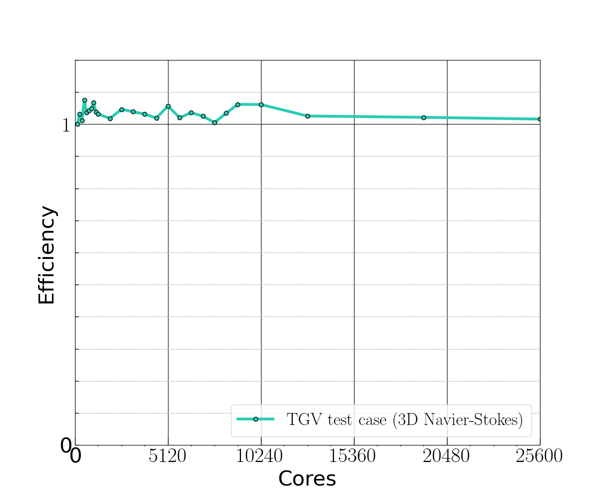

Performance evaluation of dNami
*******************************

We use two strategies to evaluate the intranode performance: 

#. roofline model in order to measure the efficiency of the code relative to the machine peaks performance; 
#. measured reduced times per degree of freedom which is a metric used by the HPC CFD community.

Most of the intranode optimization developments have been performed on double Intel Xeon Platinum 8280L CPUs (with a 240GB/s peak DRAM bandwidth). 
For this architecture, an efficient vectorization of time consuming loops is necessary to approach the platform 512-bit vector-add peak performance. 

Direct numerical simulations of the Navier—Stokes equations with handwritten finite-difference solver typically involve low arithmetic intensity (AI) computational kernels because of a large amount of data movement, which greatly reduces vectorization efficiency. dNami automatic code generation capabilities have been essential in producing high AI computational kernel for both stencil computations kernel and time-marching kernel (hereafter gathered into “Compute kernel”). 

As an example, the resulting stencil-computation kernel AI is above 10 Flop/Byte (based
on Intel Advisor 2020 roofline analysis) which is one order of magnitude higher than what a handwritten CFD code would typically achieve and within the platform compute-bound region (which starts at 8.7 Flop/Byte). 

The achieved intranode performance obtained on a double Intel Xeon Platinum 8280L workstation (56 cores) are summarized in :numref:`perftable`.
Together with platform-oriented performance metrics, the reduced time is also provided.
It measures the time spent to update one degree of freedom of the discretized time-space used to solve the PDEs. 
The metrics show that 82% of the overall elapsed time is spent on the compute kernel (corresponding to 30% of the platform DP vector-add peak).

.. _perftable:
.. table:: Intranode performance measurements obtained with the TGV test case using 10th –order accurate finite differences (11-pointwide stencils). GFlops data are obtained using the roofline analysis provided by Intel Advisor 2020.

   +--------------+-------------------+-----------------------------+------------------------+
   |              |      dNami        |          Platform           |         dNami          |
   |              | Measured (GFlops) | DP Vector ADD Peak (GFlops) | Reduced time * 10^7 (s)|
   +==============+===================+=============================+========================+
   |    Compute   |       619         |           2080              |          2.07          |
   |    kernel    |                   |                             | (82% of elapsed time)  |
   +--------------+-------------------+-----------------------------+------------------------+
   |     MPI      |        --         |            --               |         0.468          |
   | Communication|                   |                             | (18% of elapsed time)  |
   +--------------+-------------------+-----------------------------+------------------------+

Internode performance characterization has been carried out on the Deigo cluster at the Okinawa Institute of Science and Technology (OIST), which is made of 456 nodes of double AMD EPYC 7702 sockets (128 cores per node).
dNami weak scalability has been measured up to 200 nodes, using the TGV test case with
pure MPI parallelization and the OpenMPI library version 4.0.3 :numref:`efficiency_AMD`.
Each of the 200 nodes computes 5123 points (40GB/node) leading to an
overall problem size of 26.8 billion points

.. _efficiency_AMD:

   Weak scalability of dNami as measured with the TGV test case (Skew-Symetric formulation, FD11 points) on the AMD partition of the Deigo cluster at OIST.

The scalability is satisfactory up to 200 nodes,
apart from some fluctuations observed between job
submissions (unknown origin).
Compared to the Intel Xeon Platinum 8280L, the AMD node reveals a
larger sensitivity of the MPI communication kernel of dNami to
a lower memory bandwidth (which is half the Intel one), but a limited
impact on the compute-kernel (30% slower).
This demonstrates the ability of the HPC layer to mitigate the
negative impact of the lower memory bandwidth per core on AMD nodes.
Note that the OpenMP layer, which is under development, was not included
in the scalability test.

