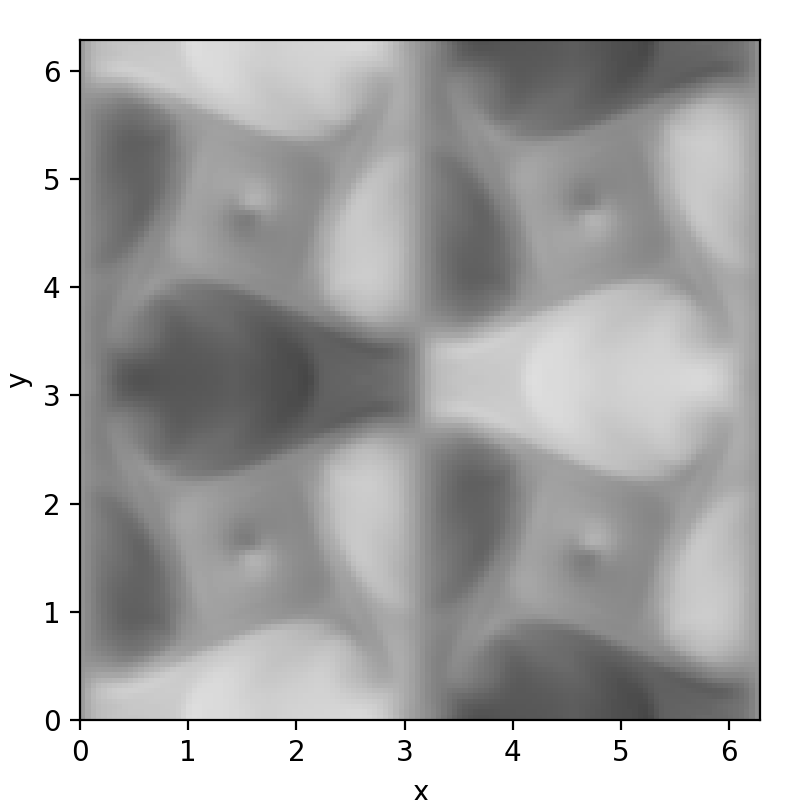

Post-processing data 
********************

Reading data 
############

dNami ships with some data loading functions to make accessing the output data transparent to the user. The three functions are:

 * ``post_io.read_restart()`` to load the `restart` files output by dNami. Only the core is read, usually for periodic cases only.
 * ``post_io.read_restart_wshell()`` to load the `restart` and `restartshell` files output by dNami. Both the core and the shell are read, usually cases with boundary conditions 
 * ``post_io.load_ax()`` to load the grid output by dNami  

For the specific inputs, users are invited to check the relevant :doc:`/usage/api` section. The following section gives a brief use-case.  

Plotting data 
#############

Below is a basic code block for reading a plotting a slice of a 3D data field output by dNami. The example assumes that the user has run the 3D TGV case (source files are in ``exm/3d_tgv``) for at least 15000 timesteps. The code-block imports ``matplotlib`` for plotting purposes. The example shows how to load the 3D data array, extract an (x,y) plane of the x-direction velocity field at half the z-direction height and plot it.   

.. code-block:: python

        # -- Import function
        import matplotlib.pyplot as plt
        import numpy as np
        from post_io import read_restart       # dnami data read function

        # -- Read data
        rpath = './restarts/restart_00015000'  # file name
        n,t,q = read_restart(rpath)            # read function - returns timestep number, time and solved variable array
        nx,ny,nz,nvar = q.shape                # get dimensions of q 
        nzmid = int(nz/2)                      # get index of half height
        uxmid = q[:,:,nzmid,1]                 # extract slice : half-height velocity (index 1) profile 

        # -- Create figure
        fig = plt.figure(figsize=(4,4))
        ax = fig.add_axes([0.10,0.1,0.85,0.85])

        ar = 1. # figure aspect ratio

        # -- Create figure
        ax.imshow(uxmid.T, cmap='Greys', origin='lower', extent=(0, 2*np.pi, 0, 2*np.pi), vmin = -1.001, vmax= 1.001)
        ax.set_aspect(ar)

        # -- Set labels
        ax.set_xlabel(r'x')
        ax.set_ylabel(r'y')

        # -- Limits
        ax.set_xlim([0.,2*np.pi])
        ax.set_ylim([0.,2*np.pi])

        # -- Save figure
        fname = 'tgv_slice.png' 
        plt.savefig(fname,dpi=200)

Running this code-block in the same work directory as the associated ``compute.py`` will yield :numref:`tgv_slice`. 

.. warning::

        This assumes that the user has sourced ``dNami/src/env_dNami.sh`` which adds the ``post_io`` functions to the Python path. 

.. _tgv_slice: 

   Output of the plotting code-block based on the 3D TGV example data

