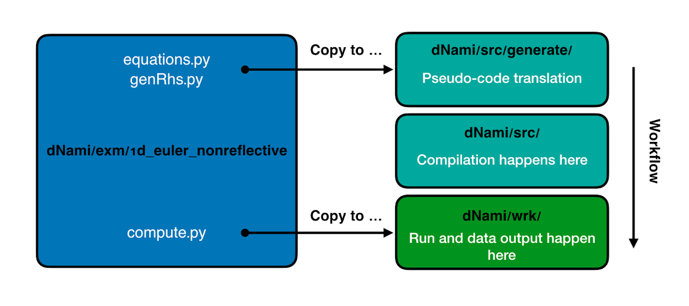
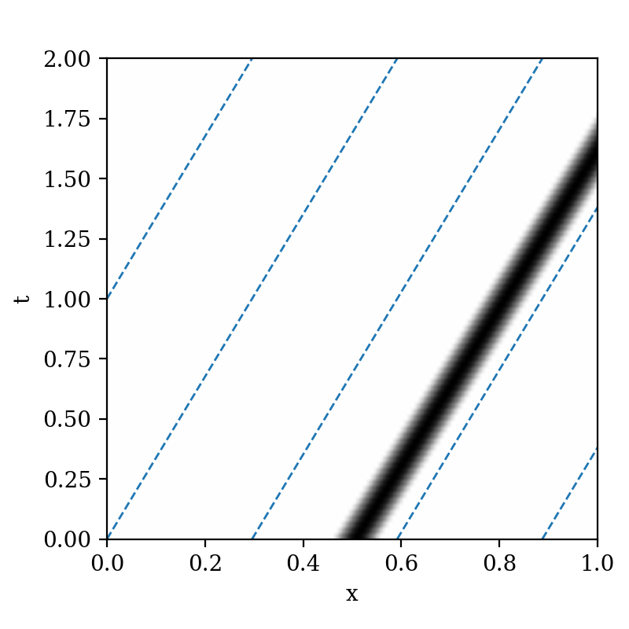

Quickstart guide
****************

Get the code and setup your environment on Unix (Linux or macOS)
----------------------------------------------------------------

The following instructions will walk you through the installation
process of dNami on Unix. You need to have a working **Python3**
environment and a **Fortran** compiler (Intel's **ifort** or the
GNU **gfortran** compiler).

#. Clone dNami from the github repository

   Navigate to the location you wish to place the code in and execute the following command:

   .. code-block:: bash

    git clone git@github.com:dNamiLab/dNami.git
    
   By default, this will create a ``dNami`` folder containing the source code. 

#. Install the dependencies

   dNami depends on the following Python packages:

   * numpy
   * scons

   These can be installed using Pythons package installer pip:

   .. code-block:: bash

    python3 -m pip install --user numpy scons

#. Additional dependencies (strongly recommended)

   If you want to run dNami in a distributed memory environment (cluster) or
   on multiple cores you also need to install **MPI** and **mpi4py**.
   If you already have a working MPI installation you can install mpi4py
   using the Python package installer pip:

   .. code-block:: bash

    python3 -m pip install --user mpi4py

   If you don't have a working MPI installation you can use your
   Linux distributions package manager to install MPI. 

   The following command will install **OpenMPI** on Ubuntu:

   .. code-block:: bash

    sudo apt-get -y install openmpi-bin

   The following command will install **OpenMPI** on macOS (if `homebrew <https://brew.sh/>`_  is installed):

   .. code-block:: bash

    brew install open-mpi

   If you are running a different Linux distribution check the documentation on how to install MPI.

Steps to run a case 
-------------------

In general, the steps to running a case will be: 

.. note::

   1. Place a ``rhs.py`` (containing the governing equations) and a ``genRhs.py`` (containing the numerical parameters) in the ``dNami/src/generate/`` folder.  
   2. Change up to ``dNami/src/`` and run the ``./install_clean.sh`` script to translate the pseudo-code and compile the generated Fortran code.  
   3. Source the environment variables (which add the required locations to the Python path) by running ``source env_dNami.sh`` in ``dNami/src/`` 
   4. Change into a user-created work directory (e.g. ``dNami/wrk/``) where the ``compute.py`` file has been placed. 
   5. Run the computation in parallel e.g. with ``mpirun -np N python3 compute.py`` (where N is the number of processes) or in serial mode ``python3 compute.py`` depending on the decomposition chosen in the ``compute.py``. 

The details of each of the keys files (``rhs.py``, ``genRhs.py`` and ``compute.py``) are specific to the problem to be solved. In the following section, the details of each step are given when solving the 1D Euler equations. 

Solving the 1D Euler equations
------------------------------

As an example and quickstart guide to the steps in setting up a case in dNami, the 1D ideal gas Euler equations

.. math::

   \dfrac{\partial }{\partial t} \begin{pmatrix} \rho  \\ \rho u  \\ \rho e_t \end{pmatrix}  + \dfrac{\partial }{\partial x} \begin{pmatrix} \rho u   \\ \rho u^2 + p   \\ u ( \rho e_t + p) \end{pmatrix}   = \mathbf{0}

are integrated in time to solve the propagation of an entropy wave out of the computational domain.

Setting up a basic case like this is essentially a three-step process:

1. Specify the governing equations and the boundary conditions in symbolic form using the dNami syntax in the ``rhs.py`` file
2. Specify the desired numerics in the ``genRhs.py`` file then generate and compile the Fortran  code
3. Specify the problem parameter and integrate the equations in time in the ``compute.py`` file

.. note::

    A minimal functional example for each of these files that allows the case to be run are given in the ``/exm/1d_euler_nonreflective`` directory. The core elements of each of these files are presented here. 

The user is referred to the API documentation for the settings and function arguments not detailed here. :numref:`exworkflow` shows an overview of the file locations and steps detailed below.  

.. _exworkflow: 

   Overview of file location and steps 

**Specifying the governing equations**

The ``rhs.py`` uses a list to define the variables to be advanced in time and python dictionaries to act as vectors with the keys acting as component identifiers. In the current case, ``rho, rho u and rho e_t`` are the quantities to be advanced in time. The primitive variables are declared using the ``varsolved`` list as follows: 

.. code-block:: python

        varsolved = ['rho','u','et']

To specify that we wish to advance them in conservative form, we refer to the corresponding position in the above list with the ``consvar`` list (the index starts at 1 as this will be used in the Fortran layer).  

.. code-block:: python

        consvar = [2,3] 

To specify the right hand side, a dictionary of the flux divergence is created with the component-by-component contributions specified with the corresponding keys.  Note the use of the `[ ]_1x` syntax for the spatial derivative. The details of this syntax are given in :doc:`/usage/syntax`.  

.. code-block:: python

        divF = {  
                'rho' : ' [ rho*u          ]_1x ', 
                'u'   : ' [ rho*u*u + p    ]_1x ', 
                'et'  : ' [ u*(rho*et + p) ]_1x ', 
               }

Intermediate variables such as the pressure term ``p`` can be either replaced when the code is generated (via an alias) or computed during the time loop, stored and used when computing the right-hand side. In the current example, an alias for ``p`` is created using the ``varloc`` dictionary. This approach gives the user flexibility to store and output intermediate variables as well as test the impact of different combinations on computational efficiency.  

.. code-block:: python

        varloc = { 'e' : ' (et - 0.5_wp*u*u) ',                        #internal energy
                   'p' : ' delta*rho*e       ',                        #pressure 
                   'c' : '( ( 1.0_wp + delta ) * p / rho  )**0.5_wp ', #isentropic speed of sound
                 }

The constant coefficients involved in the equations (e.g. ``delta``) are declared at the start of the ``rhs.py`` file in the ``coefficients`` dictionary.

.. code-block:: python

        coefficients = {
                         'delta' : 1, # R/Cv
                       }

Similarly, a separate set of equations for the boundary conditions can be symbolically specified in the ``rhs.py``. For instance, the 1D non-reflecting boundary conditions are implemented in this example using the following expression which gives the time-update of the right-hand side:

.. code-block:: python

        src_phybc_wave_i1 = {
                'rho' :' ( '+dcoefi1['rho']+'  ) ',
                'u'   :' (u * ('+dcoefi1['rho']+')  + rho * ('+dcoefi1['u']+')  ) ',
                'et'  :' (et + p/rho - c*c/delta )*('+dcoefi1['rho']+') + rho * u * ('+dcoefi1['u']+')  + c*c/delta * ('+dcoefi1['et']+')/(c)/(c) ',  
                }

The reader is referred to the file itself and the literature for the details of the physical expression. Note that no separate syntax is required to specify derivatives at the boundaries, this is automatically managed in the back-end when the Fortran code is generated.   

**Specifying the numerical options**

With the equations in place, the second step involves choosing the various numerics. In the ``genRhs.py`` file, the user can specify a number of parameters. First the ``append_Rhs`` function allows the user to choose the discretisation scheme for the input equations and whether this sets or is appended to the current RHS (via the ``update`` argument). This means that the user can compute different terms of the RHS with different spatial schemes. In the following code block, the RHS is set using the expression detailed in the previous section using a 5 point, 4\ :sup:`th` order centered finite difference stencil.  

.. code-block:: python

    append_Rhs(divF,5,4,rhsname,vnamesrc_divF,update=False,rhs=rhs,stored=True)                           

In this example, a standard 11 point, 10\ :sup:`th` order filter is used and is applied to the conservative variables using the following: 

.. code-block:: python

    genFilter(11,10,len(varsolved),rhs=rhs)

The points between the edge boundary points and the domain which is more than a half stencil away from the edge have to be dealt with differently as a full stencil of points is not available. The following code block discretises the governing equation with a progressive scheme stencil and order modification as the edge of the domain is approached:  

.. code-block:: python

    genBC(Save_eqns['divF'],3,2,rhsname ,vnamesrc_divF,update=False,rhs=rhs)

The physical boundary conditions at the edge of the domain are enforced with the following line (where derivatives are computed with a 3 point, 2\ :sup:`nd` order, one-sided derivative). The ``setbc`` option specifies the boundary in question (here ``i1``) and whether the physical boundary conditions are enforced on the RHS or directly on the primitive variables (here on the ``rhs``).  

.. code-block:: python

    genBC(src_phybc_wave_i1,3,2,rhsname,vnamesrc_divF,setbc=[True,{'char':{'i1':['rhs']}}], update=False,rhs=rhs)

.. warning::
    The ``rhs.py`` and ``genRhs.py`` files **must be placed** in the ``src/generate/`` folder.
    
Changing up to the ``src/`` folder and running the ``./install_clean.sh`` command will translate the symbolic expressions into Fortran code with the aforementioned numerics and compile the code. Running the command ``source env_dNami.sh`` will add the necessary environment variables to the path.  

**Specifying the parameters and running the computation**

The final step involves setting the run parameters and advancing the solution in time. Example parameters for the run are given below: 

.. code-block:: python

        # Solve the equation ...
        # ... for fluid ...
        delta       = dn.cst(0.4) # R/Cv

        # ... in space ...
        L = dn.cst(1.) 
        with_length = [L]         # domain length 
        with_grid   = [480]       # number of points

        # ... and time ...
        with_dt   = dn.cst(5.e-4) # time step
        filtr_amp = dn.cst(0.1)   # filter amplitude

        # ... as fast as possible!
        with_proc = [2]           # mpi proc. topology

This information is passed to the dNami Python interface which allocates the memory based on the computational parameters and prepares a number of useful aliases. The density, velocity and total energy fields can be filled with the initial conditions via references to the allocated memory. Here a half-sine wave perturbation is applied to the density field. A uniform velocity field is specified and the total energy is updated with the internal energy computed at fixed pressure corresponding to an entropy perturbation.  

.. code-block:: python

        # -- Fill density and velocity fields 
        rho[:] = rho0
        u  [:] = u0 

        # -- Add half sin-wave perturbation to the density field 
        rho[dom] += amp * ( np.cos( np.pi*(xloc[:]-dn.cst(0.5)*Lx)/Lp ) ) * ( np.abs(xloc[:] - dn.cst(0.5)*Lx) <= dn.cst(0.5)*Lp   ) 

        # -- Update total energy
        et [:] = eos_e(rho[:],p0) + dn.cst(0.5)*u0*u0 

During the time loop, the user can set the frequency at which operations and outputs take place. A few example steps are given here. First, the RHS is updated using the RK scheme implemented in dNami. Filtering is applied every ``mod_filter`` timesteps. A restart file i.e. the current state of the primitive variables at time ``ti`` is written out at a frequency ``mod_rstart``. Finally, run information such a global extrema and CFL values are printed to the standard output every ``mod_output``. Other run-time output are possible via the ``write_data`` function (e.g. the user can write out the pressure at a custom frequency).   

.. code-block:: python

        # -- Set the start and end of the time loop
        for n in range(ni,nitmax+ni):
            ti = ti + dt

            # -- Update the q using the RHS  
            for nrk in range(1,4):
                intparam[7] = nrk
                dMpi.swap(q,hlo,dtree) 
                dn.dnamiF.time_march(intparam,fltparam,data)    

            # -- Apply filtering
            if np.mod(n,mod_filter) == 0:
                dMpi.swapX(q,hlo,dtree) 
                dn.dnamiF.filter(1,intparam,fltparam,data)

            # -- Save a 'restart' i.e. the state of q at t=ti 
            if np.mod(n,mod_rstart) == 0:
                dn.dnami_io.write_restart(n,ti,0,dtree,fpath=rpath)

            # -- Output information during the run
            if np.mod(n,mod_output) == 0:

                if dMpi.ioproc:
                        print('____________________________________________________________')
                        print('iteration',n,' with time t =',ti)
                e = et - .5*(u*u)
                p = eos_p(rho,e)
                c = eos_sos(rho[hlo:nx+hlo],p[hlo:nx+hlo])
                dn.dnami_io.globalMinMax(dtree,rho[hlo:nx+hlo],'r')
                dn.dnami_io.globalMinMax(dtree,u[hlo:nx+hlo],'u')
                dn.dnami_io.globalMinMax(dtree,et[hlo:nx+hlo],'et')
                dn.dnami_io.globalMinMax(dtree,np.abs( u[hlo:nx+hlo])/c,'M')
                if dMpi.ioproc:
                        print('convective CFL numbers')
                        sys.stdout.flush()
                cfl = dt*np.abs(u[hlo:nx+hlo])/dx
                dn.dnami_io.globalMax(dtree,cfl,'cfl-x')
                if dMpi.ioproc:
                        print('acoustic CFL numbers')
                        sys.stdout.flush()
                cfl = dt*(np.abs(u[hlo:nx+hlo])+c)/dx
                dn.dnami_io.globalMax(dtree,cfl,'cfl-x')

To run the case, which is set to run on 2 cores (see the ``with_proc`` list), the user can make a work folder at the root of the ``dNami/`` folder by executing:

.. code-block:: shell

        cd /path/to/dNami/; mkdir wrk

then copy the ``compute.py`` file into the ``wrk`` folder and execute the run:

.. code-block:: shell

        cp ./exm/1d_euler_nonreflective/compute.py ./wrk/
        cd wrk 
        mpirun -np 2 python3 compute.py

The example should run for 4000 timesteps and then exit. Optionally, the user can choose to visualise the output using the provided python script ``plot_xt.py``. The script gathers the output density fields and construct an x-t diagram showing the entropy perturbation moving from the center to the right of the domain at the flow speed. The result is displayed below: 

.. _xt_quickstart: 

   x-t diagram of the entropy perturbation leaving the computation domain. The field shown is that of density fluctuations (i.e. :math:`(\rho -  \rho_0)` ).  The dashed blue lines indicate the flow speed. 

Advanced information
--------------------

To get more in-depth information about the ``genRhs.py`` and the ``compute.py``, check out for the corresponding sections:

* :doc:`../usage/genRhs`
* :doc:`../usage/compute`
