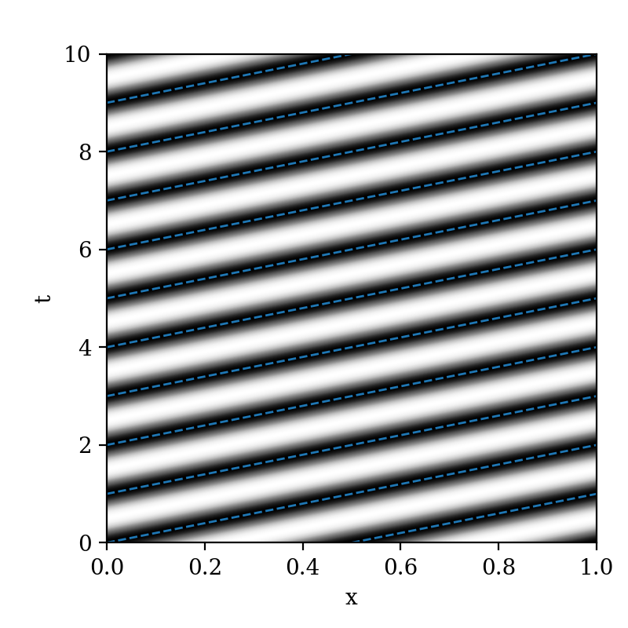
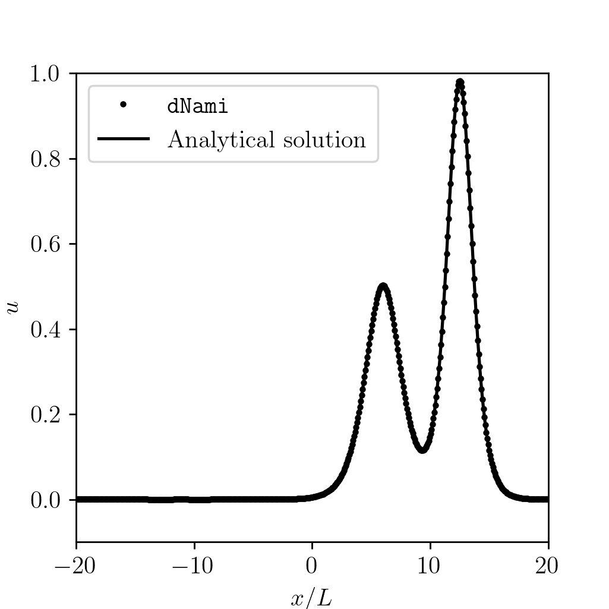
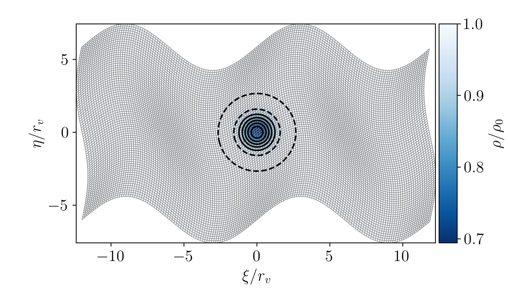
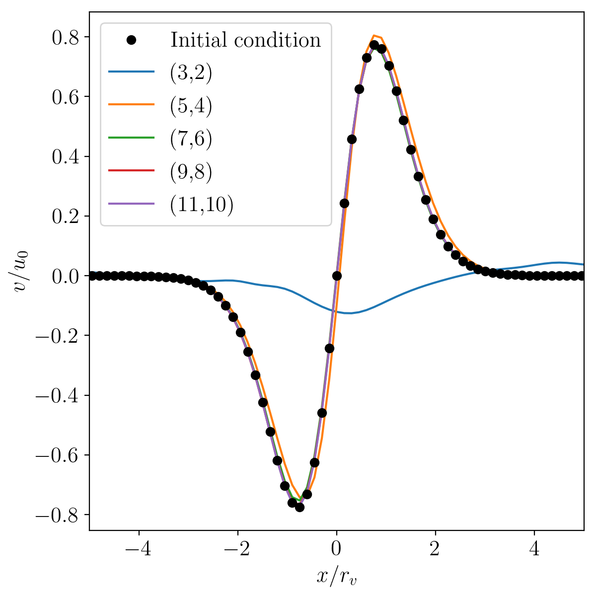
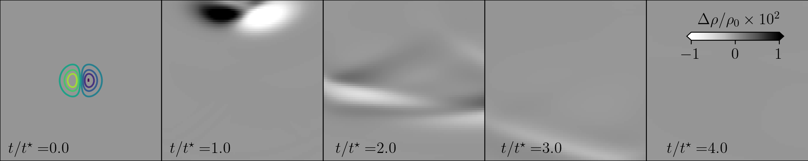
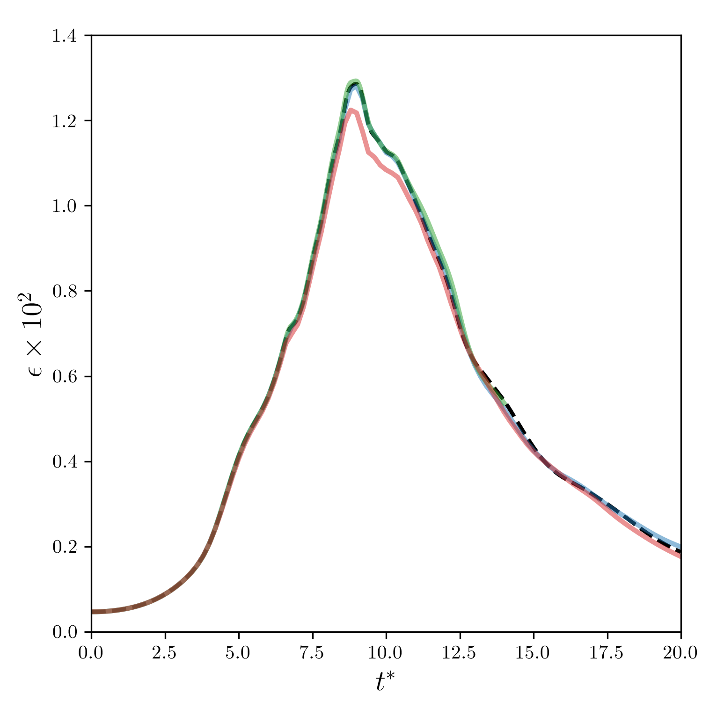

Test cases and validation
*************************

This section provides information about the test cases located in the ``exm`` folder. The necessary files to run each of the cases are provided so that users may use them as a starting point for similar cases or to test additional developments. Plotting tools are provided for some of the cases.  

One-dimensional cases
---------------------

**1) Periodic entropy wave advection**

This case solves the one-dimensional gas dynamics equations on a periodic domain:

.. math::

   \dfrac{\partial }{\partial t} \begin{pmatrix} \rho  \\ \rho u  \\ \rho e_t \end{pmatrix}  + \dfrac{\partial }{\partial x} \begin{pmatrix} \rho u   \\ \rho u^2 + p   \\ u ( \rho e_t + p) \end{pmatrix}   = \mathbf{0}

The files for this case are located in the ``exm/1d_entropywave`` folder. The initial non-dimensional density, pressure and velocity are set to :math:`(\rho/\rho_0, p/p_0, u/c_0) = (1,1,0.5)`. A sinusoidal perturbation of the density field is imposed. The amplitude of the perturbation :math:`\epsilon` is kept small in this example i.e. :math:`\epsilon=10^{-3}` to minimise non-linear effects. The case is run for 10 times the characteristic flow time. This test case complements the quick-start guide in the sense that this case is periodic. No specification of a boundary condition in a given direction in the ``genRhs.py`` defaults to the domain being periodic in that direction. Periodicity is enforced via the ``swap`` operations. The resulting x-t diagram for the density field is shown in :numref:`xt_1d_per` for the 10 characteristic flow times.  

.. _xt_1d_per: 

   x-t diagram of the density perturbation for the one-dimensional Euler equations on a periodic domain. The blue lines indicate the flow speed. 

**2) Korteweg-De Vries example** 

To illustrate  higher-than-second-order derivatives, the one-dimensional Korteweg-De Vries equation is implemented in dNami and integrated in time. The general form of the equation is:

.. math::
	\begin{equation}
	    \dfrac{\partial u}{\partial t } + \epsilon u \dfrac{\partial u}{\partial x } + \mu  \dfrac{\partial ^3 u}{\partial x^3 } = 0
	\end{equation}
 
For this test case, the scaling coefficients are set to :math:`\epsilon=6` and :math:`\mu=1`. To compute the third derivative of :math:`u` in dNami, first the second derivative is computed and stored and then a first derivative of this intermediate variable is taken when specifying the right-hand side as illustrated in the following code block:

.. code-block:: python

	varstored = { 'u_xx' : {'symb':' [u]_2xx ','ind':1, 'static': False } }
	...
	RHS = {'u' : ' epsilon * u * [ u ]_1x + mu * [ u_xx ]_1x ',}

The case of two colliding solitons is simulated here for which there is an analytical solution on an infinite domain :cite:`taha1984analytical`. The exact solution is given by:

.. _1d_kdv_sol:
.. math::
	\begin{equation}
	    u(x,t) = 2 \dfrac{\partial ^2 f  }{\partial x^2 }, \forall x \in \mathbb{R}, \forall t \in \mathbb{R},
	\end{equation}

where the function :math:`f` is defined by:

.. math::
	\begin{equation}
	    f = 1 + e^{\eta_1} + e^{\eta_2} + \left( \dfrac{k_1 - k_2}{k_1 + k_2} \right)^2  e^{\eta_1  + \eta_2},
	\end{equation}

with: 

.. math::
	\begin{align}
	    \eta_1 = k_1 x - k_1^3 t + \eta_1^{(0)}, \\
	    \eta_2 = k_2 x - k_2^3 t + \eta_2^{(0)}. \\
	\end{align}

Following :cite:`taha1984analytical`, the coefficients in the previous equations are taken to be:

.. math::
	\begin{equation}
	    k_1 = 1, \quad  k_2= \sqrt{2}, \quad \eta_1^{(0)} = 0 , \quad \eta_2^{(0)} = 2 \sqrt{2}
	\end{equation}

The domain is restricted to the segment :math:`x \in [-20,20]`, taken to be periodic and discretised with :math:`n_x=500` points. At the start of the simulation, the :math:`u` field is initialised using the analytical solution for :math:`t=0`. :numref:`1d_kdv` shows the solution after 6 time units. 

.. _1d_kdv: 

   Comparison of the numerical solution to the analytical solution after 6 time units

Two-dimensional cases
---------------------

**1) Periodic vortex advection on a wavy mesh**

This case solves the two-dimensional gasdynamics equations in curvilinear coordinates on a doubly-periodic domain using a wavy mesh for a strong conservative formulation. This case appears widely in the literature (see e.g. :cite:`visbal2002use`). The files for this case can be found in ``exm/2d_wavy_mesh``. The governing equations in curvilinear formulation are:

.. math::

        \begin{equation}
       \dfrac{\partial }{\partial t} 
       \begin{pmatrix}
        \rho \\
        \rho u \\
        \rho v \\
        \rho e_t \\
       \end{pmatrix}
       +
       J^{-1}
       \dfrac{\partial }{\partial x} 
       \begin{pmatrix}
        \rho J U  \\
        \rho u J U + \dfrac{\partial \eta}{\partial y} p \\
        \rho v J U - \dfrac{\partial \xi}{\partial y} p \\
        (\rho e_t +p ) J U \\
       \end{pmatrix}   
       +
       J^{-1}
       \dfrac{\partial }{\partial y} 
       \begin{pmatrix}
        \rho J V  \\
        \rho u J V + \dfrac{\partial \eta}{\partial x} p \\
        \rho v J V - \dfrac{\partial \xi}{\partial x} p \\
        (\rho e_t +p ) J V \\
       \end{pmatrix}  = 0    
       \end{equation}

.. math::

where :math:`J` is the Jacobian of the transformation between computational and physical space:

.. math::
   J \equiv \left( \dfrac{\partial \xi}{\partial x} \dfrac{\partial \eta}{\partial y} - \dfrac{\partial \eta}{\partial x}\dfrac{\partial \xi}{\partial y} \right)^{-1}

where :math:`U` and :math:`V` are the contra-variant velocities (i.e. the project of the velocities onto the curvilinear coordinates):

.. math::

	\begin{equation}
	    \begin{pmatrix}
	    U \\
	    V 
	    \end{pmatrix}
	    = J^{-1}
	    \begin{pmatrix}
	    \dfrac{\partial \eta}{\partial y} u - \dfrac{\partial \xi}{\partial y} v \\
	    -\dfrac{\partial \eta}{\partial x} u + \dfrac{\partial \xi}{\partial x} v \\
	    \end{pmatrix}    
	    \label{eq:dNami_contravel}
	\end{equation}

The computational space :math:`(x,y)` is related to physical space :math:`(\xi, \eta)` with the mapping: 

.. math::

   \xi  = \xi_0 + x L_x + A_x \sin( 2 \pi y) \\
   \eta = \eta_0 + y L_y + A_y \sin( 4 \pi x)

where the distances are specified relative to the vortex radius :math:`r_v`:

.. math::

   \xi_0 = -12 r_v, \ \eta_0 = -6 r_v, \ L_x = 24 r_v, \ L_y = 12 r_v, \  A_x   = 0.4 r_v, \ A_y = 1.6 r_v.

.. _2d_wmesh: 

   Colormap showing the initial density distribution with vorticity contours shown in black. The mesh is displayed in light grey with :math:`(n_x,n_y)=(160,80)`. 

The metrics are computed with the same finite difference stencil and order as the derivatives in the governing equations. A vortex is initialised at the center of the domain at :math:`(\xi_c, \eta_c)=(0,0)`. The initial flow field is then specified as:

.. math::

   \left\{
   \begin{matrix}
   u(x,y,t=0) = u_0 \left( 1 - \dfrac{M_v}{M_i} \dfrac{\eta - \eta_c}{r_v} e^{(1-r^2)/2} \right) \\ 
   v(x,y,t=0) = v_0 \left( \dfrac{M_v}{M_i} \dfrac{\xi - \xi_c}{r_v} e^{(1-r^2)/2} \right) \\ 
   \end{matrix}
   \right.

The pressure and density are initialised based on isentropic ideal gas relations:

.. math::

   \left\{
   \begin{matrix}
   \rho(x,y,t=0) = \rho_0 \left( 1 - \dfrac{\gamma -1}{2} M_v^2 e^{(1-r^2)/2} \right)^{\dfrac{1}{\gamma - 1}} \\ 
   p(x,y,t=0)    = p_0    \left( 1 - \dfrac{\gamma -1}{2} M_v^2 e^{(1-r^2)/2} \right)^{\dfrac{\gamma}{\gamma - 1}} \\ 
   \end{matrix}
   \right.

The baseflow and vortex speed are specified via the Mach numbers :math:`M_i=0.5` and :math:`M_v=0.5` respectively. The mesh and initial density condition are shown in :numref:`2d_wmesh`. The case is run at a fixed grid size and timestep for various finite-difference schemes and orders. The same 11-point, 10 :sup:`th` order filter is used for every case. The results for standard finite difference schemes from 2 :sup:`nd` to 10 :sup:`th` order are shown in :numref:`2d_wmesh_ord`.  

.. _2d_wmesh_ord:

   Comparison of results for various finite-difference stencils and orders after :math:`t = 10 u_0/L_x` (i.e 10 vortex-travel times) for mesh size :math:`(n_x,n_y)=(160,80)`.      

**2) Non-reflective vortex advection throught the boundaries**

This case solves the two-dimensional advection of a vortex through the boundaries of the domain using a non-reflective characteristic-based boundary condition implementation. It is commonly used to validate non-reflective boundary condition implementations (see e.g. :cite:`lodato2008three`). The files for this test case can be found in the ``exm/2d_vortex_exit`` folder. The two-dimensional Euler equations in cartesian coordinates are:  

.. math::

   \dfrac{\partial }{\partial t} \begin{pmatrix} \rho  \\ \rho u \\ \rho v  \\ \rho e_t \end{pmatrix}  + \dfrac{\partial }{\partial x} \begin{pmatrix} \rho u   \\ \rho u^2 + p \\ \rho u v    \\ u ( \rho e_t + p) \end{pmatrix}  + \dfrac{\partial }{\partial y} \begin{pmatrix} \rho v   \\ \rho u v \\ \rho v^2 + p    \\ v ( \rho e_t + p) \end{pmatrix} = 0

supplemented with the ideal gas law:

.. math::
   
   p = \delta \rho \left[e_t - \dfrac{1}{2} ( u^2 + v^2) \right] 

The edge and corner boundaries are updated using a locally one-dimensional non-reflective boundary condition. For example, the upper boundaries are computed using the following expressions

.. math::

   \dfrac{\partial }{\partial t} 
   \left. \begin{pmatrix} \rho  \\ \rho u \\ \rho v  \\ \rho e_t \end{pmatrix} \right|_{x, y = L_y}  =  
    - \begin{pmatrix} d_1  \\ 
      u d_1 + \rho d_2 \\ 
      v d_1 + \rho d_3 \\ 
      (e_t + p/\rho + c_p/\alpha_v) d_1 + \rho u d_2 + \rho v d_3 + c_pd_4 /( \alpha_v  c^2) 
      \end{pmatrix}

where:

.. math::

    \begin{pmatrix} d_1  \\ d_2 \\ d_3  \\ d_4 \end{pmatrix} = 
    \begin{pmatrix} (\mathcal{L}_1 + \mathcal{L}_4 )/ c^2 + \mathcal{L}_2 \\ \mathcal{L}_3 \\ (\mathcal{L}_4 - \mathcal{L}_1) /(\rho c)  \\ \mathcal{L}_1 + \mathcal{L}_4 \end{pmatrix}, \ 
    \begin{pmatrix} \mathcal{L}_1  \\ \mathcal{L}_2 \\ \mathcal{L}_3   \\ \mathcal{L}_4 \end{pmatrix} =  
    \begin{pmatrix} \dfrac{1}{2} \max(v-c,0) \left( \dfrac{\partial p}{\partial y} - \rho c \dfrac{\partial v}{\partial y} \right)  \\ \max(v,0) \left( \dfrac{\partial \rho}{ \partial y} - \dfrac{1}{c^2} \dfrac{\partial p}{\partial y} \right) \\ \max(v,0) \dfrac{\partial u}{\partial x}   \\ \dfrac{1}{2} \max(v+c,0) \left( \dfrac{\partial p}{\partial y} + \rho c \dfrac{\partial v}{\partial y} \right)  \end{pmatrix}   

The initial flow field is set using:

.. math::

   \left\{
   \begin{matrix}
   \rho(x,y,t=0) = \rho_0, \\ 
   u   (x,y,t=0) = u_{0} - \dfrac{\partial \psi}{\partial y },  \\
   v   (x,y,t=0) = v_{0} + \dfrac{\partial \psi}{\partial x },  \\
   e_t (x,y,t=0) = (p_0 + p')/(\delta \rho_0) + \dfrac{1}{2} \left( u^2 + v^2 \right) 
   \end{matrix}
   \right.

where the derivatives of the potential :math:`\psi` and the pressure fluctuation :math:`p'` are set by:

.. math::

   \left\{
   \begin{matrix}
    p'(x,y) = -\dfrac{\rho_0 \Gamma ^2}{2 R^2} e^{-r^2/R^2} , \\ 
    \dfrac{\partial \psi}{\partial y }(x,y) = - \dfrac{y-y_0}{R^2} \Gamma e^{-r^2/(2R^2)},  \\
    \dfrac{\partial \psi}{\partial x }(x,y) = - \dfrac{x-x_0}{R^2} \Gamma e^{-r^2/(2R^2)},  \\
   \end{matrix}
   \right.

The vortex is initially centered in the domain i.e. :math:`(x_0,y_0)=(0.5L_x, 0.5L_y)`. The vortex strength :math:`\Gamma` is set using :math:`\Gamma = U_{v}R \sqrt{e}` where :math:`U_{v} = 0.25`. :numref:`2d_vortex_exit` shows the density fluctuations as the vortex is advected out of the domain via the upper boundary. The governing equations are discretised using a 9 point, 8 :sup:`th` order centered finite difference scheme and the conservative variables are filtered using a standard 11 point, 10 :sup:`th` order filter. The aim of this test case is to show the ability of the boundary conditions to evacuate the vortex while generating the least amount of spurious noise. With the quasi-one dimensional approach shown here, the density fluctuation do not exceed 3.5\%.    

.. _2d_vortex_exit:

   Density fluctuations at various times during the interaction of the vortex with the non-reflective boundary. Vertical velocity contours are shown (with values in the range only at the start of the simulation).

Three-dimensional cases
-----------------------

**1) Compressible Taylor-Green vortex case** 

This case solves the compressible Navier-Stokes equations in 3D which are:

.. math::

   \dfrac{\partial }{\partial t} \begin{pmatrix} \rho  \\ \rho u \\ \rho v  \\ \rho w \\ \rho e_t \end{pmatrix}  + \dfrac{\partial }{\partial x} \begin{pmatrix} \rho u   \\ \rho u^2 + p \\ \rho u v  \\ \rho u w  \\ u ( \rho e_t + p) \end{pmatrix}  + \dfrac{\partial }{\partial y} \begin{pmatrix} \rho v   \\ \rho u v \\ \rho v^2 + p   \\ \rho v w \\ v ( \rho e_t + p) \end{pmatrix}  + \dfrac{\partial }{\partial z} 
   \begin{pmatrix} \rho w  \\ \rho u w \\ \rho vw + p   \\ \rho w^2 \\ w ( \rho e_t + p) \end{pmatrix}= \mathbf{D}

where :math:`\textbf{D}` is the matrix of diffusive terms. 

The particular problem solved here is the Taylor-Green vortex flow. The files for this case can be found in ``exm/3d_tgv``. The initial conditions for this flow are: 

.. math::

   \left\{
   \begin{matrix}
   \rho(x,y,z,t=0) =  \rho_0, \\ 
    u(x,y,z,t=0)   =  \sin(x) \cos(y) \cos(z), \\ 
    v(x,y,z,t=0  ) = -\cos(x) \sin(y) \cos(z), \\ 
    w(x,y,z,t=0  ) = 0, \\ 
    p(x,y,z,t=0  ) = p_0 + \rho_0/16 \left[ \cos(2x) + \cos(2y) \right] \left( \cos(2z) + 2 \right) 
   \end{matrix}
   \right.

The incompressible pressure solution is projected onto an isochore in thermodynamic space to set the initial internal energy. The case is setup to run with a reference Mach number of :math:`Ma = 0.45` and a Reynolds number of :math:`Re = 1600`. :numref:`3d_tgv` shows an animation of a cut of the x-direction velocity field at :math:`z=z_{max}/2` as the flow starts its transition from the smooth initial condition. The grid size is set to :math:`(n_x, n_y, n_z) = (128,128,128)`.  

.. only:: html

   .. _3d_tgv:
   .. figure:: img/tgv.gif 
      :width: 80%
      :align: center

      Animation of the x-direction velocity field at :math:`z=z_{max}/2`

The more common low-Mach validation case with :math:`Ma=0.1` is run. The complexity of the case arises as the flow transition to turbulence. A lack of spatial resolution quickly leads to a degradation of the solution due to dissipation and dispersion. A more detailed discussion can be found here :cite:`debonis2013solutions`. A commonly used measure envolves tracking the enstrophy (i.e. the domain integral of the squared vorticity) over time. This is strongly affected by numerical methods (e.g. the amount of filtering or the numerical dissipation introduced by the discretisation). With dNami pseudo-code, different formulations of the governing equations can easily be implemented. The ``rhs.py`` file for the 3D TGV case contains two versions of the equations. :numref:`3d_tgv_formulation` shows a comparison between conservative and skew-symmetric formulations for various grid sizes and a comparison to a spectral method based reference of the enstrophy  over reduced time. All three finite-difference based computations presented in the graph use an 11 point, 10 :sup:`th` order scheme.  

.. _3d_tgv_formulation:

   Comparison of the enstrophy vs time profile for the conservative formulation using 600 :sup:`3` points (blue), conservative formulation using 260 :sup:`3` points (red), skew symmetric formulation using 260 :sup:`3` points (green) and the 512 degree of freedom spectral solution (dashed black).

