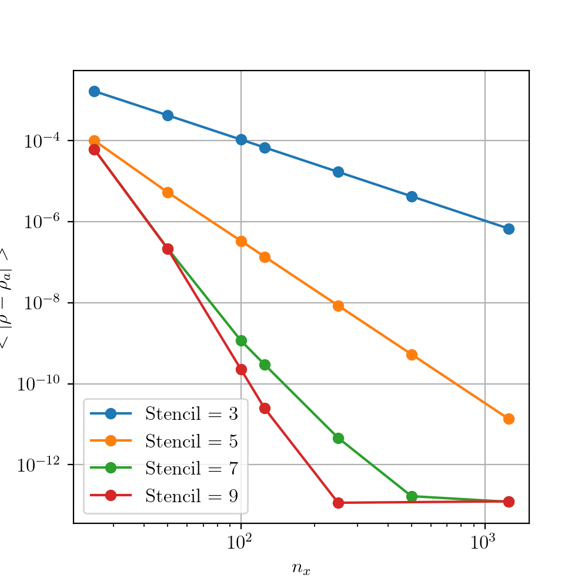
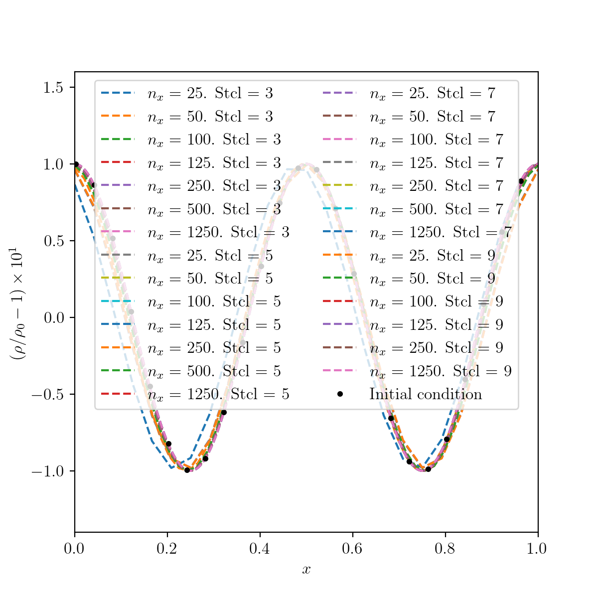
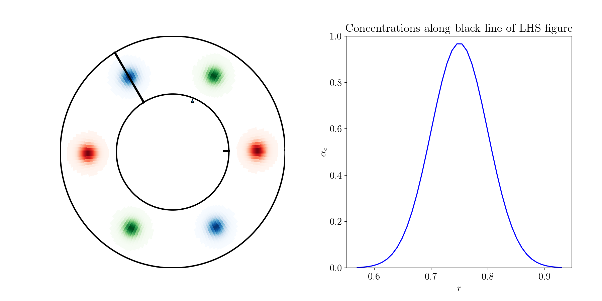
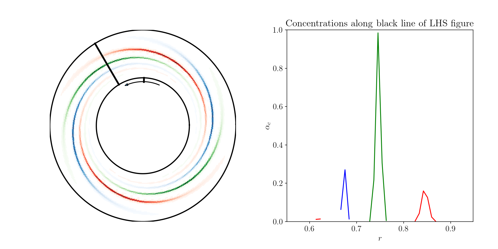

Test cases and validation
*************************

One-dimensional cases
---------------------

1) Periodic entropy wave advection

This case solves the one-dimensional gas dynamics equations on a periodic domain:

.. math::

   \dfrac{\partial }{\partial t} \begin{pmatrix} \rho  \\ \rho u  \\ \rho e_t \end{pmatrix}  + \dfrac{\partial }{\partial x} \begin{pmatrix} \rho u   \\ \rho u^2 + p   \\ u ( \rho e_t + p) \end{pmatrix}   = 0

The initial non-dimensional density, pressure and velocity are set to :math:`(\rho_0, p_0, u_0) = (X,X,X)`. A small-amplitude half-sinwave perturbation of the density field is imposed in the center of the domain. The case is run for 10 times the characterstic flow time until the perturbation is once again located in the center of the domain. 

|1d_per_init|   |1d_per_grid|

Left: initial density condition. Right: error plot versus number of grid points.      

2) Non-reflective entropy wave leaving the domain

The previous case is replicated with non-reflective boundary conditions imposed at either end of the domain. 

3) Supersonic nozzle with shock with comparison to linear solution

Two-dimensional cases
---------------------

1) Periodic vortex advection on a wavy mesh

This case solves the two-dimensional gasdynamics equations in curvilinear coordinates on a doubly-periodic domain using a wavy mesh for a weakly conservative formulation:

.. math::

   \dfrac{\partial }{\partial t} Q + \dfrac{1}{J} \left( \dfrac{\partial \eta}{\partial y} \dfrac{\partial }{\partial x} F_x - \dfrac{\partial \xi}{\partial y} \dfrac{\partial }{\partial x} F_y - \dfrac{\partial \eta}{\partial x} \dfrac{\partial }{\partial y} F_x + \dfrac{\partial \xi}{\partial x} \dfrac{\partial }{\partial y} F_y \right) = 0

where:

.. math::

   Q   = \begin{pmatrix} \rho  \\ \rho u \\ \rho v  \\ \rho e_t \end{pmatrix}, \ 
   F_x = \begin{pmatrix} \rho u \\ \rho u^2 + p \\ \rho u v \\ u ( \rho e_t + p) \end{pmatrix}, \
   F_y = \begin{pmatrix} \rho v  \\ \rho u v  \\ \rho v^2 +p    \\ v ( \rho e_t + p) \end{pmatrix}.

and :math:`J` is the Jacobian of the transformation between computational and physical space:

.. math::
   J \equiv \left( \dfrac{\partial \xi}{\partial x} \dfrac{\partial \eta}{\partial y} - \dfrac{\partial \eta}{\partial x}\dfrac{\partial \xi}{\partial y} \right)^{-1}

The computational space :math:`(x,y)` is related to physical space :math:`(\xi, \eta)` with the mapping: 

.. math::

   \xi  = \xi_0 + x L_x + A_x \sin( 2 \pi y) \\
   \eta = \eta_0 + y L_y + A_y \sin( 4 \pi x)

where the distances are specified relative to the vortex radius :math:`r_v`:

.. math::

   \xi_0 = -12 r_v, \ \eta_0 = -6 r_v, \ L_x = 24 r_v, \ L_y = 12 r_v, \  A_x   = 0.4 r_v, \ A_y = 1.6 r_v.

.. _2d_wmesh: 
.. figure:: img/2d_wavymesh_mesh.png
   :width: 70%
   :align: center

   Colormap showing the initial density distribution with vorticity contours shown in black. The mesh is displayed in light grey with :math:`(n_x,n_y)=(160,80)`. 

The metrics are computed with the same finite difference stencil and order as the derivatives in the governing equations. A vortex is initialised at the center of the domain at :math:`(\xi_c, \eta_c)=(0,0)`. The initial flow field is then specified as:

.. math::

   \left\{
   \begin{matrix}
   u(x,y,t=0) = u_0 \left( 1 - \dfrac{M_v}{M_i} \dfrac{\eta - \eta_c}{r_v} e^{(1-r^2)/2} \right) \\ 
   v(x,y,t=0) = v_0 \left( \dfrac{M_v}{M_i} \dfrac{\xi - \xi_c}{r_v} e^{(1-r^2)/2} \right) \\ 
   \end{matrix}
   \right.

The pressure and density are initialised based on isentropic ideal gas relations:

.. math::

   \left\{
   \begin{matrix}
   \rho(x,y,t=0) = \rho_0 \left( 1 - \dfrac{\gamma -1}{2} M_v^2 e^{(1-r^2)/2} \right)^{\dfrac{1}{\gamma - 1}} \\ 
   p(x,y,t=0)    = p_0    \left( 1 - \dfrac{\gamma -1}{2} M_v^2 e^{(1-r^2)/2} \right)^{\dfrac{\gamma}{\gamma - 1}} \\ 
   \end{matrix}
   \right.

The baseflow and vortex speed are specified via the Mach numbers :math:`M_i=0.5` and :math:`M_v=0.5` respectively. The mesh and initial density condition are shown in :numref:`2d_wmesh`. The case is run at a fixed grid size and timestep for various finite-difference schemes and orders. The same 11-point, 10 :sup:`th` order filter is used for every case. The results for standard finite difference schemes from 2 :sup:`nd` to 10 :sup:`th` order are shown in :numref:`2d_wmesh_ord`.  

.. _2d_wmesh_ord:
.. figure:: img/2d_wavymesh_FD.png
   :width: 50%
   :align: center

   Comparison of results for various finite-difference stencils and orders after :math:`t = 10 u_0/L_x` (i.e 10 vortex-travel times) for mesh size :math:`(n_x,n_y)=(160,80)`.      

2) Non-reflective vortex advection throught the boundaries

This case solves the two-dimensional advection of a vortex through the boundaries of the domain using a non-reflective characteristic-based boundary condition implementation. The two-dimensional Euler equations are:  

.. math::

   \dfrac{\partial }{\partial t} \begin{pmatrix} \rho  \\ \rho u \\ \rho v  \\ \rho e_t \end{pmatrix}  + \dfrac{\partial }{\partial x} \begin{pmatrix} \rho u   \\ \rho u^2 + p \\ \rho u v    \\ u ( \rho e_t + p) \end{pmatrix}  + \dfrac{\partial }{\partial y} \begin{pmatrix} \rho v   \\ \rho u v \\ \rho v^2 + p    \\ v ( \rho e_t + p) \end{pmatrix} = 0

supplemented with the ideal gas law:

.. math::
   
   p = \delta \rho \left[e_t - \dfrac{1}{2} ( u^2 + v^2) \right] 

The edge and corner boundaries are updated using a locally one-dimensional non-reflective boundary condition. For example, the upper boundaries are computed using the following expressions

.. math::

   \dfrac{\partial }{\partial t} 
   \left. \begin{pmatrix} \rho  \\ \rho u \\ \rho v  \\ \rho e_t \end{pmatrix} \right|_{x, y = L_y}  =  
    - \begin{pmatrix} d_1  \\ 
      u d_1 + \rho d_2 \\ 
      v d_1 + \rho d_3 \\ 
      (e_t + p/\rho + c_p/\alpha_v) d_1 + \rho u d_2 + \rho v d_3 + c_pd_4 /( \alpha_v  c^2) 
      \end{pmatrix}

where:

.. math::

    \begin{pmatrix} d_1  \\ d_2 \\ d_3  \\ d_4 \end{pmatrix} = 
    \begin{pmatrix} (\mathcal{L}_1 + \mathcal{L}_4 )/ c^2 + \mathcal{L}_2 \\ \mathcal{L}_3 \\ (\mathcal{L}_4 - \mathcal{L}_1) /(\rho c)  \\ \mathcal{L}_1 + \mathcal{L}_4 \end{pmatrix}, \ 
    \begin{pmatrix} \mathcal{L}_1  \\ \mathcal{L}_2 \\ \mathcal{L}_3   \\ \mathcal{L}_4 \end{pmatrix} =  
    \begin{pmatrix} \dfrac{1}{2} \max(v-c,0) \left( \dfrac{\partial p}{\partial y} - \rho c \dfrac{\partial v}{\partial y} \right)  \\ \max(v,0) \left( \dfrac{\partial \rho}{ \partial y} - \dfrac{1}{c^2} \dfrac{\partial p}{\partial y} \right) \\ \max(v,0) \dfrac{\partial u}{\partial x}   \\ \dfrac{1}{2} \max(v+c,0) \left( \dfrac{\partial p}{\partial y} + \rho c \dfrac{\partial v}{\partial y} \right)  \end{pmatrix}   

The initial flow field is set using:

.. math::

   \left\{
   \begin{matrix}
   \rho(x,y,t=0) = \rho_0, \\ 
   u   (x,y,t=0) = u_{0} - \dfrac{\partial \psi}{\partial y },  \\
   v   (x,y,t=0) = v_{0} + \dfrac{\partial \psi}{\partial x },  \\
   e_t (x,y,t=0) = (p_0 + p')/(\delta \rho_0) + \dfrac{1}{2} \left( u^2 + v^2 \right) 
   \end{matrix}
   \right.

where the derivatives of the potential :math:`\psi` and the pressure fluctuation :math:`p'` are set by:

.. math::

   \left\{
   \begin{matrix}
   & p'(x,y) = -\dfrac{\rho_0 \Gamma ^2}{2 R^2} e^{-r^2/R^2} , \\ 
   & \dfrac{\partial \psi}{\partial y }(x,y) = - \dfrac{y-y_0}{R^2} \Gamma e^{-r^2/(2R^2)},  \\
   & \dfrac{\partial \psi}{\partial x }(x,y) = - \dfrac{x-x_0}{R^2} \Gamma e^{-r^2/(2R^2)},  \\
   \end{matrix}
   \right.

The vortex is initially centered in the domain i.e. :math:`(x_0,y_0)=(0.5L_x, 0.5L_y)`

.. figure:: img/2d_vortexexit_drho.png
   :width: 100%

   Density fluctuations at various times during the interaction of the vortex with the non-reflective boundary. Vertical velocity contours are shown (with values in the range only at the start of the simulation).

3) Noh problem (explosion) in cylindrical coordinates 

This case solves the Noh problem in cylindrical coordinates:

.. math::

   \dfrac{\partial }{\partial t} Q + \dfrac{1}{r} \left ( \dfrac{\partial }{\partial r} (r F_r)  + \dfrac{\partial }{\partial \theta} F_{\theta} \right) + S   = 0

where:

.. math::
   Q          = \begin{pmatrix} \rho  \\ \rho u_r \\ \rho u_{\theta}  \\ \rho e_t \end{pmatrix}, \ 
   F_r        = \begin{pmatrix} \rho u_r \\ \rho u_r^2 + p \\ \rho u_r u_{\theta} \\ u_r ( \rho e_t + p) \end{pmatrix}, \
   F_{\theta} = \begin{pmatrix} \rho u_{\theta}  \\ \rho u_r u_{\theta}  \\ \rho u_{\theta}^2 +p    \\ u_{\theta} ( \rho e_t + p) \end{pmatrix}, \
   S          = \begin{pmatrix}  0   \\ u_{\theta}^2/r \\ u_r u_{\theta}/r    \\       0            \end{pmatrix}     

Artificial bulk viscosity is added to the governing equations to capture discontinuities in the flow field.

4) Unmixing / Reverse mixing of passive scalars

This case simulates the reverse mixing of :math:`N` passive scalars in a Taylor-Couette flow of an ideal fluid. The cylindrical Navier-Stokes (with uniform shear viscosity and thermal conductivity) are supplemented with advection equations for passive scalars:

.. math::

   \dfrac{\partial \rho \alpha_i }{ \partial t} + \dfrac{1}{r} \left[ \dfrac{ \partial r \rho u_r \alpha_i}{\partial r} + \dfrac{ \partial \rho u_{\theta} \alpha_i}{\partial \theta}  \right] = 0 \text{ for } i \in [1,N]

where :math:`\alpha_i` is the concentration of passive scalar :math:`i`. At each of the radial boundary conditions, isothermal wall conditions are imposed with a fixed velocity and temperature. The orthoradial direction is made periodic. The case is run with a Reynolds number based on the diameter difference and the inner wall rotation speed equal to :math:`Re = 1`. The number of passive scalar is set to :math:`N=3`. Two Gaussian spots for each scalar are distributed in a staggered manner around the annulus.  The initial fields of the passive scalars are shown in :numref:`2d_rev_mix_init`.

.. _2d_rev_mix_init:

   Left: Distribution of the three passive scalars (red, green and blue) around the annulus for :math:`(n_r, n_{\theta}) = (48,192)`. Right: radial cut of the concentration of each of the passive scalar.

.. _2d_rev_mix_turn:

   See :numref:`2d_rev_mix_init`.  

Three-dimensional cases
-----------------------

1) Ideal gas Couette flow
